# TG_Downloader

<div align="center">

**Next-Generation High-Performance Telegram Media Downloader & Archival Engine**

[](https://golang.org)
[](LICENSE)
[](docker-compose.yaml.example)
[](https://github.com/Hittlert/TG_Downloader)
[](docs/STREAMING_BLOCK_ENGINE_DESIGN.md)

[English](README.md) | [中文说明](README_zh.md) | [SBE v4.1 设计规范](docs/STREAMING_BLOCK_ENGINE_DESIGN.md)

</div>

---

## 📖 Overview

**TG_Downloader** is an enterprise-grade, high-throughput Telegram media downloader and automated daemon archive engine written in pure Go. Built on native MTProto multiplexing and the revolutionary **Streaming Block Engine (SBE v4.1)**, it solves common pain points of traditional Telegram downloaders (memory leaks, OOM crashes, random disk I/O congestion, large file stalls, and crash data corruption).

---

## ✨ Key Features

- 🚀 **Streaming Block Engine (SBE v4.1)**
  - **Decoupled Architecture**: 64 logical network workers and 5 disk writers operate independently through lock-free channels.
  - **Strict Dual-Lease Memory Backpressure**: `BufferLease` (96 MiB) controls in-flight network buffers while `DirtyLease` (48 MiB) caps unflushed disk pages. Physical RSS is strictly bounded under 200 MiB.
  - **Deficit Round Robin (DRR) Fair Scheduling**: Separate dual-lane queues for small files (≤10 MiB) and large files (>10 MiB) with 3:1 weighted interleaving, preventing head-of-line blocking.
- 🛡️ **Crash-Resilience & Resumable Downloads**
  - **Sidecar Checkpoint Bitmaps**: Dedicated `.meta` sidecar files pre-allocated based on `TotalBlocks`, featuring dual-slot (A/B) CRC32 checksummed state persistence.
  - **Atomic Commit Chain**: Linux `unix.Renameat2(RENAME_NOREPLACE)` with fallback to `linkat + unlink` to guarantee zero data overwrites.
- 🌐 **Modern Apple-Style Responsive Web Dashboard**
  - Real-time 5-second smoothed rolling bandwidth charts.
  - Active downloading task cards (progress, throughput, DC node, retry counts).
  - Target channel and group management, scanning progress, and historical stats.
- 🔄 **Intelligent Multi-Proxy Watchdog**
  - Background health probe for SOCKS5/HTTP proxy endpoints.
  - Deterministic round-robin proxy failover within 30 seconds of MTProto network stalls.
  - Persistent 24-hour proxy metrics and speed baselines.

---

## 🏗️ Architecture Pipeline

```mermaid
flowchart TD
    subgraph SBE_v4_1 ["Streaming Block Engine (SBE v4.1) Pipeline"]
        A["Telegram Channels / Chat Monitor"] --> B["Task Queue (SQLite Backend)"]
        B --> C["DRR Dual-Lane Scheduler (Small : Large = 3:1)"]
        
        subgraph NetStage ["Network Streaming Stage"]
            C --> D{"Acquire BufferLease (Cap 96 MiB)"}
            D -->|Granted| E["64x Network Workers (Long-lived MTProto Sessions)"]
            E -->|Download 2MB Block| F["Leased Block Buffer"]
        end
        
        subgraph DiskStage ["Disk Persistence Stage"]
            F --> G{"Acquire DirtyLease (Cap 48 MiB)"}
            G -->|Granted| H["5x Disk Writers (Sequential PwriteAt)"]
            H -->|Write .part| I["Release BufferLease"]
            H -->|Flush Batch & fdatasync| J["Write Checkpoint to Sidecar .meta"]
            J --> K["Release DirtyLease"]
        end
        
        subgraph CommitStage ["Atomic Commit Stage"]
            K -->|All Blocks Persisted| L["fsync Parent Directory"]
            L --> M["Atomic Rename (RENAME_NOREPLACE / linkat)"]
            M --> N["Update SQLite Status to SUCCESS"]
        end
    end
```



---

## 🚀 Quick Start

### 1. Docker Compose (Recommended)

Copy the example compose file and start the daemon:

```bash
cp docker-compose.yaml.example docker-compose.yaml
docker compose up -d
```

Open your browser and navigate to:
```text
http://<your-server-ip>:5000
```

### 2. Binary Build & Run

Ensure you have **Go 1.25+** installed:

```bash
# Clone the repository
git clone https://github.com/Hittlert/TG_Downloader.git
cd TG_Downloader

# Build binary
go build -o tg-downloader .

# Initialize session and login
./tg-downloader login

# Start daemon server with Web UI
./tg-downloader serve --listen 0.0.0.0:5000 --dir ./downloads --db-path ./state/records.sqlite3
```

---

## ⚙️ Configuration Reference

| Parameter | CLI Flag | Default | Description |
| :--- | :--- | :--- | :--- |
| `listen` | `--listen` | `0.0.0.0:5000` | Web UI & API listen address |
| `dir` | `--dir` | `/app/downloads` | Final media download directory |
| `temp-dir` | `--temp-dir` | `/app/temp/tdl` | Temporary block download directory (`.part` / `.meta`) |
| `db-path` | `--db-path` | `records.sqlite3` | SQLite task state and historical database |
| `file-concurrency` | `--file-concurrency` | `64` | Maximum concurrent logical file sessions |
| `download-threads` | `--download-threads` | `16` | Maximum concurrent block workers per large file |
| `dc-pool-size` | `--dc-pool-size` | `64` | Long-lived MTProto connection pool capacity |

---

## 📂 Project Structure

```text
├── cmd/               # CLI commands (serve, dl, login, chat, migrate, etc.)
├── app/               # Daemon server, Web UI, Watchdog & Orchestrator
│   └── daemon/        # Web dashboard templates, REST APIs, task registry
├── core/              # Low-level MTProto client, DC pool & SBE block engine
│   ├── dcpool/        # Multi-DC connection pooling and keep-alive
│   ├── downloader/    # MTProto chunk multiplexer
│   └── tmedia/        # Media metadata parsers and converters
├── pkg/               # Reusable packages (bitmaps, memory leases, storage, utils)
├── docs/              # Comprehensive architectural & SBE v4.1 specifications
├── Dockerfile         # Production multi-stage Docker build
└── docker-compose.yaml.example # Template Docker Compose file
```

---

## 🙏 Acknowledgments & Evolution

This project's underlying MTProto protocol client and session toolchain are derived from the open-source project [tdl](https://github.com/iyear/tdl) (licensed under GNU AGPL-3.0).

Building upon this foundation, **TG_Downloader** introduces a ground-up re-architecture tailored for enterprise 7x24h automated daemon operations:
1. **Streaming Block Engine (SBE v4.1)**: Pure block-level decoupling between network workers and disk writers, enforced by dual-lease memory backpressure (`BufferLease` 96 MiB + `DirtyLease` 48 MiB) and DRR fair scheduling.
2. **Crash-Resilient Atomic Persistence**: Sidecar pre-allocated dual-slot CRC32 checkpoint bitmaps and Linux `RENAME_NOREPLACE` atomic commit fallback chains.
3. **Automated Daemon & Modern Web Dashboard**: Full-featured Apple-style responsive Web UI, continuous channel scanning, and transparent proxy watchdog failover.

---

## 📄 License

This project is licensed under the [GNU Affero General Public License v3.0 (AGPL-3.0)](LICENSE).

