# TGX

<div align="center">

**TGX - Next-Generation Telegram Media Downloader & Streaming Archive Engine**

[](https://golang.org)
[](LICENSE)
[](docker-compose.yaml.example)
[](https://github.com/Hittlert/TGX)
[](docs/STREAMING_BLOCK_ENGINE_DESIGN.md)
[](docs/STREAMING_BLOCK_ENGINE_DESIGN.md)

[English](README.md) | [中文说明](README_zh.md) | [Master Architecture & Technical Spec](docs/STREAMING_BLOCK_ENGINE_DESIGN.md)

</div>

---

## 📖 Overview

**TGX** is an enterprise-grade, high-throughput Telegram media downloader and automated daemon archive engine written in pure Go. Featuring the revolutionary **Dual-Lane Native Streaming Engine** and an in-process **Embedded sing-box Engine**, it solves the fundamental pain points of traditional Telegram downloaders: random disk seek storms from small files, large file bandwidth starvation, memory bloat, and account FloodWait bans.

---

## ✨ Key Features

- 🚀 **Dual-Lane Streaming Block Engine**
  - **Decoupled Streaming Pipeline**: 32 unified shared network workers dynamically pull streams, while 6 dedicated disk writers (1 small file serial writer + 5 large file chunk writers) flush data smoothly.
  - **Small File Lane ($\le 1\text{ MiB}$)**: Single-worker whole-file in-memory fetch with a dedicated 128 MiB isolated RAM budget, in-memory SHA256 hashing, and strictly 1 dedicated serial disk writer handling directory creation, flush, sync, and atomic rename, eliminating random mechanical disk seek storms.
  - **Large File Lane ($> 1\text{ MiB}$)**: Strictly bounded active large files (default: 5) with a 4-chunk in-flight guarantee (512 KiB/chunk) and 1-to-1 dedicated disk writer bindings with offset reordering for sequential writes.
  - **Adaptive FloodGate Rate Limiter**: Baseline safe 40.0 req/s, burst 10 with AIMD (Adaptive Increase Multiplicative Decrease) dynamic rate backoff upon Telegram FloodWait.
- ⚡ **Embedded sing-box Engine & Watchdog**
  - **In-Process Memory-Level Outbound**: Directly integrates `sing-box` in Go memory without local 127.0.0.1 loopback socket overhead.
  - **Full Modern Protocol Suite**: Native support for VLESS (Reality), Hysteria2, TUIC, Shadowsocks, VMess, Trojan, and WireGuard.
  - **Visual Node & Subscription Management**: Paste proxy links or base64 subscriptions directly into the Web UI for instant hot-reloading.
  - **Intelligent Proxy Watchdog**: Automatic periodic health probes and failover upon network disruptions.
- 🛡️ **Crash Resilience & Atomic Commit**
  - **Atomic Non-Replacing Commit**: Linux `unix.Renameat2(RENAME_NOREPLACE)` with atomic `linkat + unlinkat` fallback chain to prevent file overwrites.
  - **Dual DC Authorization Sharding**: Management calls (dialog/message queries) strictly route to authenticated primary client, while chunk downloads utilize 32-connection DC pools.
- 🌐 **Modern Apple-Style Responsive Web Dashboard**
  - Real-time 5-second smoothed rolling bandwidth curves.
  - Live downloading task cards (block progress, throughput, DC node, retry counts).
  - Target channel and group management, scanning status, and historical stats.

---

## 🏗️ Architecture Pipeline

```mermaid
flowchart TD
    subgraph NetLayer ["Network & Embedded Proxy Layer"]
        Watchdog["Proxy Watchdog (Health Check / Failover)"] -.-> Router{"Outbound Router"}
        Router -->|Node / Subscription| SB["Embedded sing-box Engine (In-Memory)"]
        Router -->|--proxy Flag| ExtProxy["External SOCKS5 / HTTP Proxy"]
        Router -->|Direct| Direct["Direct Internet"]

        SB --> Gotd["MTProto Long-Lived Session Pool (32 Conns / DC)"]
        ExtProxy --> Gotd
        Direct --> Gotd
    end

    subgraph DualLane_Pipeline ["Dual-Lane Native Streaming Pipeline"]
        DB[(SQLite Task DB WAL FULL)] --> Orchestrator["Orchestrator & Task Scheduler"]
        Orchestrator -->|Large Files > 1MB| SlotPool["Slot Pool (Max 5 Large)"]
        Orchestrator -->|Small Files <= 1MB| Registry["Task Registry"]
        SlotPool --> Registry
        Registry --> Downloader["Downloader Dual-Lane Scheduler"]

        subgraph LaneSmall ["Small File Lane (<= 1 MiB)"]
            Downloader -->|128MB Memory Budget| NetSmall["Single Worker Whole-File Pull"]
            NetSmall --> MemBuf["128MB In-Memory Buffer (In-Memory SHA256)"]
            MemBuf --> SmallWriter["1x Serial Small Disk Writer"]
            SmallWriter -->|Strict Serial Write / Sync / Rename| DiskSmall["NAS Storage"]
        end

        subgraph LaneLarge ["Large File Lane (> 1 MiB)"]
            Downloader -->|4-Chunk Guarantee| NetLarge["32x Shared Network Workers (512KB Chunks)"]
            NetLarge --> LargeWriters["5x Dedicated Large Disk Writers (1-to-1 Sequential Write)"]
            LargeWriters -->|Sequential WriteAt / Sync / Rename| DiskLarge["NAS Storage"]
        end
    end
```



---

## 🚀 Quick Start

### 🐳 Docker Deployment (Recommended)

```bash
docker run -d \
  --name tgx \
  -p 5000:5000 \
  -v /path/to/data:/data \
  -v /path/to/downloads:/downloads \
  -e TDL_NS=production \
  hittlert/tgx:latest
```

---

## 📄 License

This project is licensed under the [AGPL-3.0 License](LICENSE).
