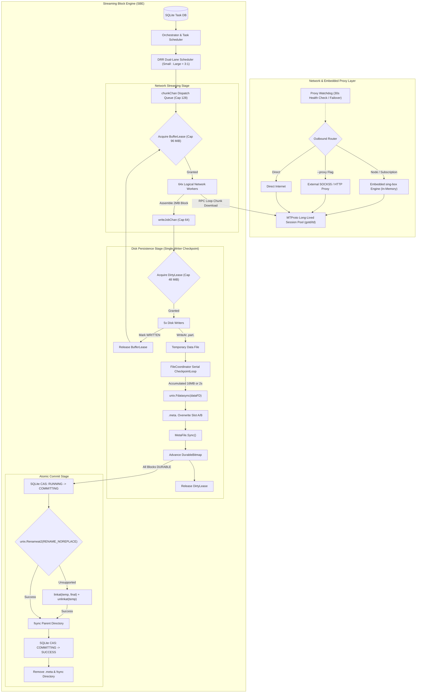

# TGX

<div align="center">

**TGX - Next-Generation Telegram Media Downloader & Streaming Archive Engine**

[](https://golang.org)
[](LICENSE)
[](docker-compose.yaml.example)
[](https://github.com/Hittlert/TGX)
[](docs/STREAMING_BLOCK_ENGINE_DESIGN.md)
[](docs/STREAMING_BLOCK_ENGINE_DESIGN.md)

[English](README.md) | [中文说明](README_zh.md) | [Master Architecture & Technical Spec](docs/STREAMING_BLOCK_ENGINE_DESIGN.md)

</div>

---

## 📖 Overview

**TGX** is an enterprise-grade, high-throughput Telegram media downloader and automated daemon archive engine written in pure Go. Featuring the revolutionary **Streaming Block Engine (SBE)** and a native in-process **Embedded sing-box Engine**, it solves the fundamental pain points of traditional Telegram downloaders: memory bloat and OOM crashes, random disk I/O congestion, large file starvation, and crash data corruption.

---

## ✨ Key Features

- 🚀 **Streaming Block Engine (SBE)**
  - **Decoupled Streaming Pipeline**: 64 logical network workers and 5 disk writers operate completely decoupled via lock-free channels.
  - **Dual-Lease Memory Backpressure**: Bounded `BufferLease` (96 MiB) caps network buffering while `DirtyLease` (48 MiB) acquired strictly *before* `WriteAt` caps uncommitted dirty pages.
  - **Deficit Round Robin (DRR) Fair Scheduling**: Dedicated dual-lane queues for small files (≤10 MiB) and large files (>10 MiB) with 3:1 weighted interleaving, preventing head-of-line blocking.
- ⚡ **Embedded sing-box Engine & Watchdog**
  - **In-Process Memory-Level Outbound**: Directly integrates `sing-box` in Go memory without local 127.0.0.1 loopback socket overhead.
  - **Full Modern Protocol Suite**: Native support for VLESS (Reality), Hysteria2, TUIC, Shadowsocks, VMess, Trojan, and WireGuard.
  - **Visual Node & Subscription Management**: Paste proxy links or base64 subscriptions directly into the Web UI for instant hot-reloading.
  - **Intelligent Proxy Watchdog**: 30-second periodic health probes and deterministic round-robin failover upon network disruptions, with fallback support for standard external SOCKS5/HTTP proxies.
- 🛡️ **Crash Resilience & Resumable Downloads**
  - **Attempt-Bound Sidecar Checkpoints**: Dedicated `.meta.<AttemptID>` pre-allocated files with dual-slot (Slot A/B) CRC32 checksummed state persistence, driven by a dedicated single-writer `CheckpointLoop`.
  - **Atomic Non-Replacing Commit**: Linux `unix.Renameat2(RENAME_NOREPLACE)` with atomic `linkat + unlinkat` fallback chain to prevent file overwrites.
- 🌐 **Modern Apple-Style Responsive Web Dashboard**
  - Real-time 5-second smoothed rolling bandwidth curves.
  - Live downloading task cards (block progress, throughput, DC node, retry counts).
  - Target channel and group management, scanning status, and historical stats.

---

## 🏗️ Architecture Pipeline



---

## 🚀 Quick Start

### 1. Docker Compose (Recommended)

Copy the example compose file and start the daemon:

```bash
cp docker-compose.yaml.example docker-compose.yaml
docker compose up -d
```

Open your browser and navigate to:
```text
http://<your-server-ip>:5000
```

### 2. Binary Build & Run

Ensure you have **Go 1.25+** installed:

```bash
# Clone the repository
git clone https://github.com/Hittlert/TGX.git
cd TGX

# Build binary
go build -o tgx .

# Initialize session and login
./tgx login

# Start daemon server with Web UI
./tgx serve --listen 0.0.0.0:5000 --dir ./downloads --db-path ./state/records.sqlite3
```

---

## ⚙️ Configuration Reference

| Parameter | CLI Flag | Default | Description |
| :--- | :--- | :--- | :--- |
| `listen` | `--listen` | `0.0.0.0:5000` | Web UI & REST API listen address |
| `dir` | `--dir` | `/app/downloads` | Final media download directory |
| `temp-dir` | `--temp-dir` | `/app/temp/tg-downloader` | Temporary block download directory (`.part` / `.meta`) |
| `db-path` | `--db-path` | `records.sqlite3` | SQLite task state and historical database |
| `file-concurrency` | `--file-concurrency` | `64` | Maximum concurrent logical file sessions |
| `download-threads` | `--download-threads` | `16` | Maximum concurrent block workers per large file |
| `dc-pool-size` | `--dc-pool-size` | `64` | Long-lived MTProto connection pool capacity |

---

## 📂 Project Structure

```text
├── cmd/               # CLI commands (serve, dl, login, chat, migrate, etc.)
├── app/               # Daemon server, Web UI, Watchdog & Orchestrator
│   └── daemon/        # Web dashboard templates, REST APIs, task registry
├── core/              # Low-level MTProto client, DC pool & SBE block engine
│   ├── dcpool/        # Multi-DC connection pooling and keep-alive
│   ├── downloader/    # MTProto chunk multiplexer
│   └── tmedia/        # Media metadata parsers and converters
├── pkg/               # Reusable packages (bitmaps, memory leases, storage, utils)
├── docs/              # Master architecture & technical specification
├── Dockerfile         # Production multi-stage Docker build
└── docker-compose.yaml.example # Template Docker Compose file
```

---

## 🙏 Acknowledgments & Evolution

This project's underlying MTProto protocol client and session toolchain are derived from the open-source project [tdl](https://github.com/iyear/tdl) (licensed under GNU AGPL-3.0).

Building upon this foundation, **TGX** introduces a ground-up re-architecture tailored for enterprise 7x24h automated daemon operations:
1. **Streaming Block Engine (SBE)**: Pure block-level decoupling between network workers and disk writers, enforced by dual-lease memory backpressure (`BufferLease` 96 MiB + `DirtyLease` 48 MiB) and DRR fair scheduling.
2. **Embedded sing-box Engine**: Native in-process proxy core supporting VLESS (Reality), Hysteria2, TUIC, and SS with zero loopback latency.
3. **Crash-Resilient Atomic Persistence**: Sidecar Attempt-bound dual-slot CRC32 checkpoint bitmaps and Linux `RENAME_NOREPLACE` atomic commit fallback chains.
4. **Automated Daemon & Modern Web Dashboard**: Full-featured Apple-style responsive Web UI, continuous channel scanning, and transparent proxy watchdog failover.

---

## 📄 License

This project is licensed under the [GNU Affero General Public License v3.0 (AGPL-3.0)](LICENSE).
