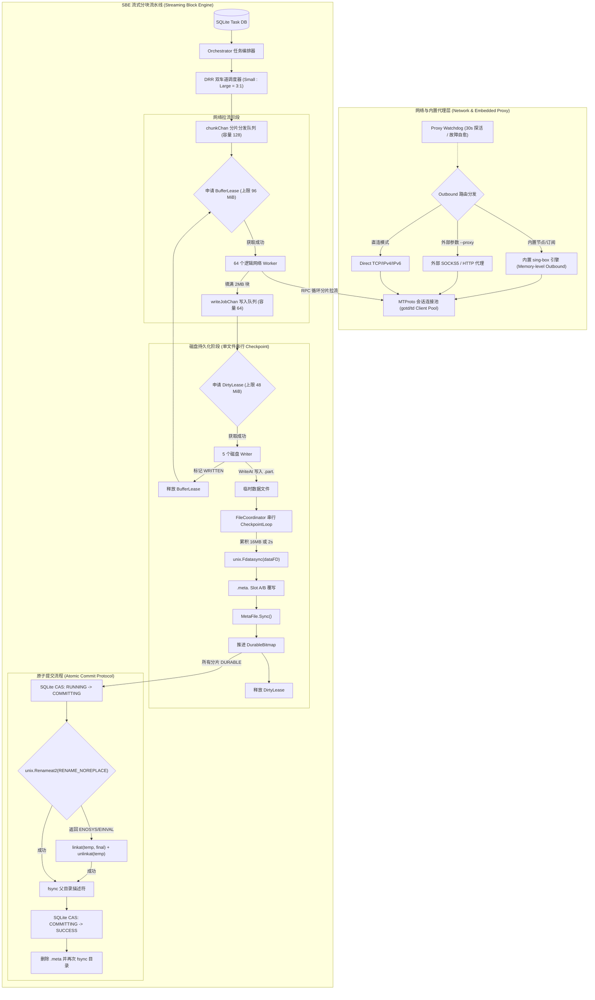

# TGX

<div align="center">

**TGX - 下一代高性能 Telegram 媒体自动化下载与流式归档引擎**

[](https://golang.org)
[](LICENSE)
[](docker-compose.yaml.example)
[](https://github.com/Hittlert/TGX)
[](docs/STREAMING_BLOCK_ENGINE_DESIGN.md)
[](docs/STREAMING_BLOCK_ENGINE_DESIGN.md)

[English](README.md) | [中文说明](README_zh.md) | [系统架构与技术实现规范](docs/STREAMING_BLOCK_ENGINE_DESIGN.md)

</div>

---

## 📖 项目简介

**TGX** 是专为大规模 Telegram 媒体长期自动化归档、高吞吐下载与低资源占用 NAS / Linux 服务器部署而设计的工业级 Go 原生引擎。基于自主研发的 **Streaming Block Engine (SBE)** 流式分块存储引擎与原生进程级 **内置 sing-box 网络核心**，彻底解决传统下载工具普遍存在的**内存暴涨 (OOM)、磁盘随机 I/O 拥塞、大文件下载饥饿断流与掉电数据损坏**等核心痛点。

---

## ✨ 核心特性

- 🚀 **Streaming Block Engine (SBE) 流式分块引擎**
  - **网络与磁盘物理完全解耦**：64 个逻辑网络 Worker 与 5 个磁盘 Writer 通过无锁通道异步运转，网络满速拉流，磁盘平滑顺序写入。
  - **双额度内存租赁背压 (Dual-Lease Backpressure)**：`BufferLease` (96 MiB) 严格限制网络缓冲区，`DirtyLease` (48 MiB) 在调用 `WriteAt` 前刚性获取，杜绝脏数据无界积压。
  - **加权差额轮询 (DRR) 公平调度**：小文件（≤10 MiB）与大文件（>10 MiB）分属独立双车道，按 3:1 加权交替发牌，小文件即到即下，大文件不出现带宽饥饿。
- ⚡ **内置 sing-box 网络驱动与 Proxy Watchdog**
  - **进程内存级直连**：原生集成 `sing-box` 核心，Outbound 直接注入 Go Transport，彻底免除本地 127.0.0.1 Loopback 握手往返与内核拷贝开销。
  - **主流全协议支持**：原生支持 VLESS (Reality)、Hysteria2、TUIC、Shadowsocks、VMess、Trojan、WireGuard 等协议。
  - **Web 控制台可视化节点管理**：直接在 Web 界面粘贴节点链接或 Base64 订阅链接，热加载即时生效。
  - **智能看门狗故障自愈**：后台每 30 秒心跳探活，网络阻断时自动轮询故障转移（Failover），同时保留对外部 SOCKS5/HTTP 代理的兼容。
- 🛡️ **高抗崩溃能力与断点续传**
  - **Attempt 绑定的侧车位图持久化**：专属 `.meta.<AttemptID>` 侧车文件包含文件身份与 Attempt 签名，通过单写者 `CheckpointLoop` 串行执行双槽位（Slot A/B）CRC32 校验轮转。
  - **原子提交保护链**：优先调用 Linux `unix.Renameat2(..., RENAME_NOREPLACE)`，并提供 `linkat + unlinkat` 安全回退链，坚决杜绝同名文件覆盖风险。
- 🌐 **现代化 Apple 风格响应式 Web 管理控制台**
  - 实时 5 秒滑动平均带宽速率曲线与历史数据统计。
  - 正在下载任务卡片（展示分块进度、速率、DC 节点、重试次数等）。
  - 监控频道与群组管理、扫描状态跟踪与实时增量同步。

---

## 🏗️ 架构与数据流水线



---

## 🚀 快速上手

### 1. Docker Compose 部署（推荐）

复制示例配置文件并启动服务：

```bash
cp docker-compose.yaml.example docker-compose.yaml
docker compose up -d
```

打开浏览器访问：
```text
http://<服务器IP>:5000
```

### 2. 本地二进制编译与运行

环境要求：**Go 1.25+**

```bash
# 克隆仓库
git clone https://github.com/Hittlert/TGX.git
cd TGX

# 编译二进制文件
go build -o tgx .

# 登录并初始化 Telegram 会话
./tgx login

# 启动守护进程与 Web UI
./tgx serve --listen 0.0.0.0:5000 --dir ./downloads --db-path ./state/records.sqlite3
```

---

## ⚙️ 核心参数指南

| 参数名称 | CLI 参数项 | 默认值 | 功能说明 |
| :--- | :--- | :--- | :--- |
| `listen` | `--listen` | `0.0.0.0:5000` | Web 控制台与 REST API 监听地址 |
| `dir` | `--dir` | `/app/downloads` | 最终媒体文件落盘目录 |
| `temp-dir` | `--temp-dir` | `/app/temp/tg-downloader` | 临时分块下载目录（存放 `.part` 与 `.meta`） |
| `db-path` | `--db-path` | `records.sqlite3` | SQLite 任务状态库与历史归档库路径 |
| `file-concurrency` | `--file-concurrency` | `64` | 全局最大并发逻辑文件任务数 |
| `download-threads` | `--download-threads` | `16` | 单个大文件最大并行拉流分块 Worker 数 |
| `dc-pool-size` | `--dc-pool-size` | `64` | MTProto 长连接池容量 |

---

## 📂 代码工程结构

```text
├── cmd/               # CLI 命令入口 (serve, dl, login, chat, migrate 等)
├── app/               # 守护进程核心、Web UI 控制台、Watchdog 与调度器
│   └── daemon/        # Web 模板资源、REST API、任务注册表
├── core/              # 底层 MTProto 客户端、DC 连接池与 SBE 分块引擎
│   ├── dcpool/        # 多数据中心 (DC) 连接池与长连接保活
│   ├── downloader/    # MTProto 分块多路复用拉流器
│   └── tmedia/        # 媒体元数据解析器与类型转换器
├── pkg/               # 通用工具包 (位图、内存租赁池、存储、校验等)
├── docs/              # 权威系统架构与技术实现规范
├── Dockerfile         # 生产级多阶段 Docker 构建镜像文件
└── docker-compose.yaml.example # 生产环境 Docker Compose 部署模板
```

---

## 🙏 致谢与演进说明 (Acknowledgments)

本项目底层 MTProto 协议交互与登录工具链衍生自开源项目 [tdl](https://github.com/iyear/tdl)（基于 GNU AGPL-3.0 协议）。

在此基础上，**TGX** 针对 7x24h 长期自动化归档与 NAS 部署场景进行了全面的自主架构演进：
1. **研发全新的 SBE 流式块存储引擎**：彻底实现网络 Worker 与磁盘 Writer 解耦，引入双额度租赁内存背压（`BufferLease` 96MB + `DirtyLease` 48MB）与 DRR 双车道公平调度。
2. **内置 sing-box 进程级代理核心**：内存级直连消除 Loopback 开销，支持 VLESS (Reality)、Hysteria2、TUIC、SS 全协议与 30s 故障自愈看门狗。
3. **重构崩溃一致性与断点续传**：实现侧车 Attempt 绑定预分配双槽 CRC32 Checkpoint，以及 Linux `RENAME_NOREPLACE` + `linkat` 原子提交回退链。
4. **构建完整的自动化守护系统**：提供现代化 Apple 风格响应式 Web 控制台与多频道增量扫描。

---

## 📄 开源许可证

本项目基于 [GNU Affero 通用公共许可证 v3.0 (AGPL-3.0)](LICENSE) 开源。
