# TGX

<div align="center">

**TGX - 下一代高性能 Telegram 媒体自动化下载与流式归档引擎**

[](https://golang.org)
[](LICENSE)
[](docker-compose.yaml.example)
[](https://github.com/Hittlert/TGX)
[](docs/STREAMING_BLOCK_ENGINE_DESIGN.md)
[](docs/STREAMING_BLOCK_ENGINE_DESIGN.md)

[English](README.md) | [中文说明](README_zh.md) | [系统架构与技术实现规范](docs/STREAMING_BLOCK_ENGINE_DESIGN.md)

</div>

---

## 📖 项目简介

**TGX** 是专为大规模 Telegram 媒体长期自动化归档、高吞吐下载与低资源占用 NAS / Linux 服务器部署而设计的工业级 Go 原生引擎。基于自主研发的 **Dual-Lane 原生双通道流式调度引擎** 与原生进程级 **内置 sing-box 网络核心**，彻底解决传统下载工具普遍存在的**小文件海量随机写伤盘、大文件网络饥饿降速、内存无界暴涨 (OOM) 与账号频繁触发 FloodWait** 等核心痛点。

---

## ✨ 核心特性

- 🚀 **Dual-Lane 原生双通道流式存储引擎**
  - **网络与磁盘物理完全解耦**：32 个统一共享网络 Worker 动态拉流，6 个磁盘 Writer（1 个小文件串行 Writer + 5 个大文件专属分片 Writer）顺序落盘。
  - **小文件（$\le 1\text{ MiB}$）全内存缓存与单写者串行落盘**：小文件由 1 个网络 Worker 完整拉取至内存（128 MiB 独立隔离内存预算），并在内存中计算 SHA256，严格由 1 个专属磁盘 Writer 串行执行落盘、sync 与重命名，彻底根除机械硬盘海量随机小文件寻道风暴。
  - **大文件（$> 1\text{ MiB}$）4 分片并发保底与专属 Writer**：严格限制最大活跃大文件数（默认 5），为每个活跃大文件保底 4 个在途分片（512 KiB/块），每个活跃大文件绑定专属磁盘 Writer 保证单文件块写入严格有序。
  - **自适应动态 FloodGate 风控**：默认 40.0 req/s，burst 10。在触发 Telegram FloodWait 时自适应阶梯降频退避，并在冷却后渐进恢复，兼顾极致吞吐与账号长期安全。
- ⚡ **内置 sing-box 网络驱动与 Proxy Watchdog**
  - **进程内存级直连**：原生集成 `sing-box` 核心，Outbound 直接注入 Go Transport，彻底免除本地 127.0.0.1 Loopback 握手往返与内核拷贝开销。
  - **主流全协议支持**：原生支持 VLESS (Reality)、Hysteria2、TUIC、Shadowsocks、VMess、Trojan、WireGuard 等协议。
  - **Web 控制台可视化节点管理**：直接在 Web 界面粘贴节点链接或 Base64 订阅链接，热加载即时生效。
  - **智能看门狗故障自愈**：后台心跳探活，网络阻断时自动轮询故障转移（Failover），同时保留对外部 SOCKS5/HTTP 代理的兼容。
- 🛡️ **高抗崩溃能力与原子提交**
  - **原子提交保护链**：优先调用 Linux `unix.Renameat2(..., RENAME_NOREPLACE)`，并提供 `linkat + unlinkat` 安全回退链，坚决杜绝同名文件覆盖风险。
  - **双 DC 授权分流**：管理通道（对话与消息检索）严格走主连接鉴权，数据通道（分片下载）全面启用 32 条并发连接池。
- 🌐 **现代化 Apple 风格响应式 Web 管理控制台**
  - 实时 5 秒滑动平均带宽速率曲线与历史数据统计。
  - 正在下载任务卡片（展示分块进度、速率、DC 节点、重试次数等）。
  - 监控频道与群组管理、扫描状态跟踪与实时增量同步。

---

## 🏗️ 架构与数据流水线

```mermaid
flowchart TD
    subgraph NetLayer ["网络与内置代理层 (Network & Embedded Proxy)"]
        Watchdog["Proxy Watchdog (探活 / 故障自愈)"] -.-> Router{"Outbound 路由分发"}
        Router -->|内置节点/订阅| SB["内置 sing-box 引擎 (Memory-level Outbound)"]
        Router -->|外部参数 --proxy| ExtProxy["外部 SOCKS5 / HTTP 代理"]
        Router -->|直连模式| Direct["Direct TCP/IPv4/IPv6"]

        SB --> Gotd["MTProto 会话连接池 (32 Conns / DC)"]
        ExtProxy --> Gotd
        Direct --> Gotd
    end

    subgraph DualLane_Pipeline ["Dual-Lane 原生双通道调度引擎"]
        DB[(SQLite Task DB)] --> Orchestrator["Orchestrator 任务编排器"]
        Orchestrator -->|大文件 > 1MB 申请 Slot| SlotPool["Slot Pool (Max 5 Large)"]
        Orchestrator -->|小文件 <= 1MB 免 Slot| Registry["Task Registry"]
        SlotPool --> Registry

        Registry --> Downloader["Downloader Dual-Lane 调度器"]

        subgraph LaneSmall ["小文件通道 (<= 1 MiB)"]
            Downloader -->|申请 128MB 内存预算| NetSmall["单 Worker 整文件内存拉取"]
            NetSmall --> MemBuf["128MB 隔离内存缓存 (含内存 SHA256)"]
            MemBuf --> SmallWriter["1 个小文件串行 Disk Writer"]
            SmallWriter -->|严格串行 Write / Sync / Rename| DiskSmall["NAS 硬盘存储"]
        end

        subgraph LaneLarge ["大文件通道 (> 1 MiB)"]
            Downloader -->|保底 4 Chunk 在途| NetLarge["32 共享 Worker 512KB 分片拉流"]
            NetLarge --> LargeWriters["5 个专属大文件 Disk Writer (1 对 1 顺序写)"]
            LargeWriters -->|顺序 WriteAt / Sync / Rename| DiskLarge["NAS 硬盘存储"]
        end
    end
```



---

## 🚀 快速开始

### 🐳 Docker 部署（推荐）

```bash
docker run -d \
  --name tgx \
  -p 5000:5000 \
  -v /path/to/data:/data \
  -v /path/to/downloads:/downloads \
  -e TDL_NS=production \
  hittlert/tgx:latest
```

---

## 📄 许可证

本项目基于 [AGPL-3.0 许可证](LICENSE) 开源。
