# TG_Downloader

<div align="center">

**下一代高性能 Telegram 媒体自动化下载与流式归档引擎**

[](https://golang.org)
[](LICENSE)
[](docker-compose.yaml.example)
[](https://github.com/Hittlert/TG_Downloader)
[](docs/STREAMING_BLOCK_ENGINE_DESIGN.md)

[English](README.md) | [中文说明](README_zh.md) | [SBE v4.1 详细技术规范](docs/STREAMING_BLOCK_ENGINE_DESIGN.md)

</div>

---

## 📖 项目简介

**TG_Downloader** 是专为大规模 Telegram 媒体长期自动化归档、高吞吐下载与低资源占用 NAS 部署而设计的工业级 Go 原生引擎。基于原生 MTProto 会话多路复用与创新的 **Streaming Block Engine (SBE v4.1)** 流式分块流水线，彻底解决传统下载工具普遍存在的**内存暴涨 (OOM)、磁盘随机 I/O 拥塞、大文件下载饥饿断流与掉电数据写坏**等核心痛点。

---

## ✨ 核心特性

- 🚀 **Streaming Block Engine (SBE v4.1) 流式分块引擎**
  - **网络与磁盘完全解耦**：64 个逻辑网络 Worker 与 5 个磁盘 Writer 通过无锁通道异步运转，网络满速拉流，磁盘平滑顺序写入。
  - **双额度内存租赁背压 (Dual-Lease Backpressure)**：`BufferLease` (96 MiB) 限制网络并发缓冲，`DirtyLease` (48 MiB) 限制未落盘脏页。物理常驻内存 (RSS) 严格强力锁定在 200 MiB 以内，彻底根治低配 NAS 上的 OOM 强杀。
  - **加权差额轮询 (DRR) 公平调度**：小文件（≤10 MiB）与大文件（>10 MiB）分属独立双车道，按 3:1 加权交替发牌，小文件即到即下，大文件不出现带宽饥饿。
- 🛡️ **高抗崩溃能力与断点续传**
  - **侧车位图持久化**：依据 `TotalBlocks` 初始化预分配专属 `.meta` 侧车文件，双槽位（Slot A/B）CRC32 校验原子轮转，故障恢复时 0 毫秒完成分块对账。
  - **原子提交保护链**：优先调用 Linux `unix.Renameat2(..., RENAME_NOREPLACE)`，并提供 `linkat + unlink` 回退链，坚决杜绝同名文件覆盖风险。
- 🌐 **现代化 Apple 风格响应式 Web 管理控制台**
  - 实时 5 秒滑动平均带宽速率曲线与历史数据统计。
  - 正在下载任务卡片（展示分块进度、速率、DC 节点、重试次数等）。
  - 监控频道与群组管理、扫描状态跟踪与实时增量同步。
- 🔄 **智能多代理看门狗 (Proxy Watchdog)**
  - 后台周期性对 SOCKS5/HTTP 代理节点进行透明探活。
  - 当 MTProto 网络阻断或握手超时时，30 秒内自动执行平滑轮询故障转移（Proxy Failover）。
  - 磁盘持久化 24 小时代理速率指标与健康度基线。

---

## 🏗️ 架构与数据流水线

```mermaid
flowchart TD
    subgraph SBE_v4_1 ["SBE v4.1 流水线架构"]
        A["Telegram 频道/群组监听"] --> B["任务队列 (SQLite 持久化)"]
        B --> C["DRR 双车道调度器 (小文件 : 大文件 = 3:1)"]
        
        subgraph NetStage ["网络拉流阶段"]
            C --> D{"申请 BufferLease (上限 96 MiB)"}
            D -->|成功获取| E["64x 逻辑网络 Worker (长期 MTProto 会话)"]
            E -->|下载 2MB 分块| F["内存分块缓冲区"]
        end
        
        subgraph DiskStage ["磁盘持久化阶段"]
            F --> G{"申请 DirtyLease (上限 48 MiB)"}
            G -->|成功获取| H["5x 磁盘 Writer (顺序 PwriteAt)"]
            H -->|写入 .part 文件| I["释放 BufferLease"]
            H -->|批次聚合落盘 fdatasync| J["覆写 .meta 双槽 Checkpoint"]
            J --> K["释放 DirtyLease"]
        end
        
        subgraph CommitStage ["原子提交流程"]
            K -->|全部分块持久化完成| L["fsync 父目录"]
            L --> M["原子重命名 (RENAME_NOREPLACE / linkat)"]
            M --> N["更新 SQLite 任务状态为 SUCCESS"]
        end
    end
```



---

## 🚀 快速上手

### 1. Docker Compose 部署（推荐）

复制示例配置文件并启动服务：

```bash
cp docker-compose.yaml.example docker-compose.yaml
docker compose up -d
```

打开浏览器访问：
```text
http://<服务器IP>:5000
```

### 2. 本地二进制编译与运行

环境要求：**Go 1.25+**

```bash
# 克隆仓库
git clone https://github.com/Hittlert/TG_Downloader.git
cd TG_Downloader

# 编译二进制文件
go build -o tg-downloader .

# 登录并初始化 Telegram 会话
./tg-downloader login

# 启动守护进程与 Web UI
./tg-downloader serve --listen 0.0.0.0:5000 --dir ./downloads --db-path ./state/records.sqlite3
```

---

## ⚙️ 核心参数指南

| 参数名称 | CLI 参数项 | 默认值 | 功能说明 |
| :--- | :--- | :--- | :--- |
| `listen` | `--listen` | `0.0.0.0:5000` | Web 控制台与 REST API 监听地址 |
| `dir` | `--dir` | `/app/downloads` | 最终媒体文件落盘目录 |
| `temp-dir` | `--temp-dir` | `/app/temp/tdl` | 临时分块下载目录（存放 `.part` 与 `.meta`） |
| `db-path` | `--db-path` | `records.sqlite3` | SQLite 任务状态库与历史归档库路径 |
| `file-concurrency` | `--file-concurrency` | `64` | 全局最大并发逻辑文件任务数 |
| `download-threads` | `--download-threads` | `16` | 单个大文件最大并行拉流分块 Worker 数 |
| `dc-pool-size` | `--dc-pool-size` | `64` | MTProto 长连接池容量 |

---

## 📂 代码工程结构

```text
├── cmd/               # CLI 命令入口 (serve, dl, login, chat, migrate 等)
├── app/               # 守护进程核心、Web UI 控制台、Watchdog 与调度器
│   └── daemon/        # Web 模板资源、REST API、任务注册表
├── core/              # 底层 MTProto 客户端、DC 连接池与 SBE 分块引擎
│   ├── dcpool/        # 多数据中心 (DC) 连接池与长连接保活
│   ├── downloader/    # MTProto 分块多路复用拉流器
│   └── tmedia/        # 媒体元数据解析器与类型转换器
├── pkg/               # 通用工具包 (位图、内存租赁池、存储、校验等)
├── docs/              # SBE v4.1 详细技术架构规范与演进文档
├── Dockerfile         # 生产级多阶段 Docker 构建镜像文件
└── docker-compose.yaml.example # 生产环境 Docker Compose 部署模板
```

---

## 🙏 致谢与演进说明 (Acknowledgments)

本项目底层 MTProto 协议交互与登录工具链衍生自开源项目 [tdl](https://github.com/iyear/tdl)（基于 GNU AGPL-3.0 协议）。

在此基础上，**TG_Downloader** 针对 7x24h 长期自动化归档与 NAS 部署场景进行了全面的自主架构演进：
1. **研发全新的 SBE v4.1 流式块存储引擎**：彻底实现网络 Worker 与磁盘 Writer 解耦，引入双额度租赁内存背压（`BufferLease` 96MB + `DirtyLease` 48MB）与 DRR 双车道公平调度。
2. **重构崩溃一致性与断点续传**：实现侧车按分片预分配双槽 CRC32 Checkpoint，以及 Linux `RENAME_NOREPLACE` + `linkat` 原子提交回退链。
3. **构建完整的自动化守护系统**：提供现代化 Apple 风格响应式 Web 控制台、多频道增量扫描与多节点代理看门狗（Proxy Watchdog）故障自愈。

---

## 📄 开源许可证

本项目基于 [GNU Affero 通用公共许可证 v3.0 (AGPL-3.0)](LICENSE) 开源。

