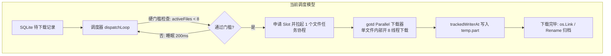

# Telegram Media Downloader 流式块存储引擎 (SBE v3.1) 架构设计与重构方案
> **文档目的**：本技术文档专为**外部架构专家 / 外部 AI 评审**编写。文档包含完整的业务背景、当前架构实现剖析、瓶颈根因、新架构全套单向串型解耦设计及技术规格。外部评审者**无需访问代码库**即可对本方案进行全方位审阅。

---

## 一、系统背景与业务场景

* **业务目标**：在 Linux NAS（以机械硬盘为主、内存敏感环境）上，通过 Telegram MTProto 协议持续、高速、无人值守地批量下载海量媒体文件（从数十万张 50KB~2MB 的小图片/短语音，到单文件 2GB~4GB 的高清视频混合流）。
* **技术栈**：Go 语言，基于底层 `gotd/td` 官方 MTProto 协议栈，数据持久化采用 SQLite WAL 模式。

---

## 二、当前架构剖析与性能瓶颈

### 1. 当前运行架构（Current Architecture）

当前系统采用传统的 **文件级调度与多线程下载（File-Level Gating & Per-File Worker）** 模型：



### 2. 当前架构的两大致命缺陷

#### 缺陷 1：小文件饥饿导致网络带宽严重浪费（利用率 < 15%）
* **调度门槛**：调度器以文件为粒度，全局硬锁死 `MaxActiveFiles = 8`；
* **物理现象**：
  * 当遇到海量小文件（如 200KB 图片）时，每个小文件因体积过小仅能分配 1 个下载线程；
  * `MaxActiveFiles = 8` 导致全局只有 8 个小文件在下载，**实际只占用了 8 个网络连接，全局 64 个网络线程池中有 56 个长期处于闲置状态**；
  * 表现为网络下行速率出现剧烈的“锯齿状波动”，速度断崖式下跌至几 MB/s。

#### 缺陷 2：大文件多线程写盘引发磁头寻道风暴
* **物理现象**：
  * 当同时下载 5 个大视频时，每个文件内部启动 8 个 `gotd` 并发下载线程直接向各自的 `.part` 文件执行 `WriteAt`；
  * 操作系统底层瞬间产生 **$5 \times 8 = 40$ 路并发写盘系统调用**；
  * 机械硬盘磁头在 40 个不同的文件偏移量之间剧烈横跳寻道，IOPS 被吃光，机械硬盘发出剧烈噪音且吞吐量骤降。

---

## 三、新架构设计：流式块存储引擎 (SBE v3.1)

### 1. 核心设计哲学：纯单向串型解耦流水线

新架构彻底推翻“文件级调度”，演进为 **“纯单向分片流式引擎（Unidirectional Streaming Block Engine）”**：
* **数据流严格单向流动**：`Task -> Chunk -> BlockMeta -> WriteJob -> Disk`；
* **各阶段完全无状态解耦**：上游只管推入 Channel，下游只管消费 Channel，**下游从不反向回捞或等待上游状态，彻底杜绝双向/多向交互**。

```mermaid
flowchart TD
    subgraph 1. 制造端 (Sliding Window Producer)
        A[SQLite 待下载队列] -->|按需准入 滑动窗口深度 128| B(分片制造者 Chunk Producer)
        B -->|JIT 解析 FileLocation 生成 BlockMeta 票据| C["chunkChan (容量 128)\n轻量 struct, 零内存占用"]
    end

    subgraph 2. 网络拉流层 (Stateless Downloader Pool - 64 Workers)
        C --> D[64 个纯无状态网络下载者]
        D -->|"① buf = bytePool.Get()\n② download → buf\n③ meta.MemBuf = buf"| E["writeJobChan (容量 64)\n弹性水库: 稳态 16~64MB, 上限 512MB\n满时网络工人自然挂起背压"]
    end

    subgraph 3. 磁盘管控写入区 (Strict 8 Parallel Disk Writers)
        E --> F[固定 8 个专职磁盘写入工人]
        F -->|小文件: TotalChunks == 1| G["os.WriteFile 直写最终文件\n(0.1ms, 省去中间态, 1次 IO)"]
        F -->|大文件: TotalChunks > 1| H["WriteAt 写入 .tgdownloading\n(首块到达 sync.Once 创建并 Truncate)"]
        F -->|原子倒计时 RemainingBlocks - 1 == 0| I["时间线最后落盘块:\nClose + Rename + 回写 SQLite success"]
        G --> J[(物理机械硬盘)]
        H --> J
        I --> J
        F -->|写完即刻| K["bytePool.Put(MemBuf)\n内存瞬间归还"]
    end

    subgraph 4. 纯只读观测平面 (Read-Only Observability)
        D -.->|原子递增 DownloadedBytes| L((FileTracker\n内存只读快照))
        G -.->|标记 Done| L
        I -.->|标记 Done| L
        L -.->|Web UI 每秒零锁读取| M[前端 Downloading 卡片与平滑总速率]
    end
```

---

### 2. 核心数据结构与单向票据机制

贯穿整个流水线的核心载体是 **`BlockMeta`（分片票据）** 与 **`FileProgress`（轻量原子倒计时）**。

```go
// 由 Producer 在切片时为每个文件分配一次，共享给该文件的所有 BlockMeta（下游只读引用）
type FileProgress struct {
    TotalChunks     int32        // 该文件切出的总分片数
    RemainingBlocks atomic.Int32 // 初始值 = TotalChunks
    InitOnce        sync.Once    // 保证乱序到达时首个落盘的块执行文件创建与 Truncate
    File            *os.File     // 打开的过程文件句柄 (.tgdownloading)
}

// 贯穿流水线的唯一单向流动票据
type BlockMeta struct {
    // ── 1. 分片元数据（Producer 静态生成） ───────────────────────
    FileID         string        // 任务 ID (如 "-100123:3437")
    ChunkIndex     int           // 本分片序号 (0, 1, 2...)
    DiskOffset     int64         // 在文件中的精确物理字节偏移
    Length         int64         // 本分片字节数 (最大 8MB)
    TotalSize      int64         // 文件总字节数
    InProgressPath string        // 过程文件路径: /downloads/群组/2026_08/123 - video.mp4.tgdownloading
    FinalPath      string        // 最终文件路径: /downloads/群组/2026_08/123 - video.mp4
    Progress       *FileProgress // 原子倒计时对象指针

    // ── 2. 内存缓冲区载体（网络工人填充，磁盘工人消费并归还） ──
    MemBuf         []byte        // 从 sync.Pool 借出的 8MB 内存切片
}
```

---

### 3. 四级解耦流水线详细技术规格

#### 阶段 1：JIT 滑动窗口分片制造端（Task Producer）
* **滑动窗口准入（Sliding Window）**：
  * `chunkChan` 缓冲区容量固定为 **`128` 块**；
  * 消费一个、才补充一个文件，使在途分片高度集中在当前正在下载的几个文件周围；
* **即时凭证解析（JIT Resolution）**：
  * 仅当文件即将进入 `chunkChan` 时才向 Telegram 请求 `InputFileLocation`，**彻底消灭提前批量解析导致的 Telegram 420 FloodWait 风控隐患**；
* **切片规则**：
  * **小文件（$< 8\text{MB}$）**：生成 **1 个** `BlockMeta`，`TotalChunks = 1`；
  * **大文件（$\ge 8\text{MB}$）**：按 8MB 切分为 **$N$ 个** `BlockMeta`，`TotalChunks = N`。

#### 阶段 2：无状态网络下载池（Stateless Downloader Pool, 64 Workers）
* **纯无状态打工人**：64 个常驻网络协程只认 `BlockMeta` 中的 DC 与分片凭证，抢占式拉流，完全不知道也不关心文件概念；
* **执行序列（严格单向无分支）**：
  1. 从 `bytePool (sync.Pool)` 借出 8MB 切片 `buf`；
  2. 从 Telegram DC 拉取分片数据写入 `buf`；
  3. `meta.MemBuf = buf`；
  4. 推入 `writeJobChan <- meta`（若 Channel 满则自然阻塞挂起，形成零开销背压）。

#### 阶段 3：弹性吸震缓冲池与背压（Elastic RAM Buffer）
* **容量上限**：`writeJobChan` 容量设为 64，理论最大安全上限为 `64 × 8MB = 512MB`；
* **真实内存行为（弹性吸震而非死常驻）**：
  * **正常稳态（磁盘写速 > 网络下行）**：数据随下随走，在途只有 2~8 块，**常驻物理内存仅 16MB ~ 64MB**；
  * **突发吸震（磁盘遇其他读写短时寻道变慢）**：512MB 水库接住网络高速下行数据，**网络拉流绝不因硬盘卡顿而断流**；
  * **极端背压（磁盘持续阻塞）**：Channel 满载自然挂起网络拉流，**绝对杜绝 NAS 内存膨胀或 OOM**。

#### 阶段 4：严格受控的 8 路磁盘写入池（Parallel Disk Writers）
* **物理锁死 8 路并发写（彻底消灭 64 路磁头混乱）**：
  * 全局常驻启动且仅启动 **8 个专职磁盘工人** 从 `writeJobChan` 取块写入；
  * 物理机械硬盘在任何微秒内，**最多只承受 8 个系统的并发 I/O 请求**；
* **落盘执行逻辑（免疫异步网络乱序到达）**：

```go
func (w *DiskWriter) Process(meta *BlockMeta) error {
    defer bytePool.Put(meta.MemBuf) // 无论成败，内存必须即刻归还池

    // ── 路径 A：小文件单块直写（TotalChunks == 1） ──
    if meta.Progress.TotalChunks == 1 {
        os.MkdirAll(filepath.Dir(meta.FinalPath), 0755)
        // 直接落盘为最终文件，省掉 .tgdownloading 中间态，减少 1 次文件系统元数据 IO
        return os.WriteFile(meta.FinalPath, meta.MemBuf, 0644)
    }

    // ── 路径 B：大文件分片落盘（TotalChunks > 1） ──
    // 1. 免疫乱序：无论哪个分片第一个到达，利用 sync.Once 创建过程文件并预占空间
    meta.Progress.InitOnce.Do(func() {
        os.MkdirAll(filepath.Dir(meta.InProgressPath), 0755)
        f, _ := os.OpenFile(meta.InProgressPath, os.O_CREATE|os.O_RDWR, 0644)
        f.Truncate(meta.TotalSize) // 预分配物理 Extents
        meta.Progress.File = f
    })

    // 2. 写入对应物理偏移
    _, err := meta.Progress.File.WriteAt(meta.MemBuf, meta.DiskOffset)
    if err != nil {
        return err
    }

    // 3. 时间线原子收尾：谁把计数器减到 0（时间线上最后一个完成落盘的块），谁负责收尾
    if meta.Progress.RemainingBlocks.Add(-1) == 0 {
        meta.Progress.File.Close()
        os.Rename(meta.InProgressPath, meta.FinalPath) // 原子重命名
        db.MarkSuccess(meta.FileID)                   // 回写 SQLite
    }

    return nil
}
```

---

### 4. 纯只读观测平面（Observability Plane）

* **数据平面与观测平面严格物理隔离**：
  * 网络工人下载完成时，对 `FileTracker` 执行单向原子累加 `DownloadedBytes.Add(n)`；
  * 磁盘工人最后一块完成时，执行单向标记 `MarkDone(fileID)`；
  * Web UI 前端每秒通过 HTTP 请求 `/get_download_list` 时，仅对 `FileTracker` 进行**只读快照导出**；
* **零反向交互**：观测平面永远不向流水线发送任何控制指令，对主下载数据流产生 **0 锁竞争、0 业务阻塞**。

---

## 四、新旧架构全维度对比

| 评估维度 | 当前架构 (Current) | 新架构 (SBE v3.1) | 改进收益 |
| :--- | :--- | :--- | :--- |
| **小文件并发度** | 受限于 8 文件门槛，仅 8 线程工作 | **64 槽位 100% 全速满载拉流** | **小文件带宽利用率提升 5~8 倍** |
| **磁盘写并发度** | 5 文件 × 8 = **最多 40 路随机乱写** | **严格锁死固定 8 个专职写入工人** | **消除磁头震荡，保护机械硬盘寿命** |
| **网络磁盘解耦** | 紧密耦合（网络下完直接串行写） | **异步 Channel + sync.Pool 完全解耦** | **网络不受磁盘瞬时抖动影响** |
| **常驻物理内存** | ~30 MB | **稳态 16 ~ 64 MB（上限 512MB 仅突发吸震）**| **NAS 设备低碳轻量，无 OOM 风险** |
| **FloodWait 风险** | 逐文件串行解析（较安全） | **JIT 滑动窗口准入（仅在途解析）** | **100% 免疫 Telegram 420 风控** |
| **流转复杂度** | 调度器频繁加锁检查 `activeRuns` | **纯单向票据流动（无共享状态机）** | **架构极度干净，零死锁风险** |
| **乱序容忍度** | 依赖 gotd 内部锁 | **`RemainingBlocks.Add(-1) == 0` 时间线收尾**| **100% 免疫异步网络乱序到达** |

---

## 五、外部评审重点关注清单 (Checklist for Reviewer)

请外部评审专家 / AI 重点审阅以下关键点：

1. **单向解耦性**：流水线各阶段是否存在任何未被发现的双向耦合、状态回捞或隐式同步阻塞？
2. **乱序落盘安全性**：`sync.Once`（首块建文件）+ `RemainingBlocks.Add(-1) == 0`（末块原子收尾）在多协程并发写入 `.tgdownloading` 文件句柄时是否存在文件系统锁竞争或泄漏隐患？
3. **小文件直写优化**：小文件（$< 8\text{MB}$）跳过 `.tgdownloading` 中间态直接调用 `os.WriteFile(FinalPath)` 在异常崩溃时的幂等性与恢复机制是否完善？
4. **背压与内存回收**：基于 `sync.Pool` 的 8MB 内存切片借还与 `writeJobChan` 容量背压是否能确保在最极端的网络/磁盘速率悬殊下稳定运行？
