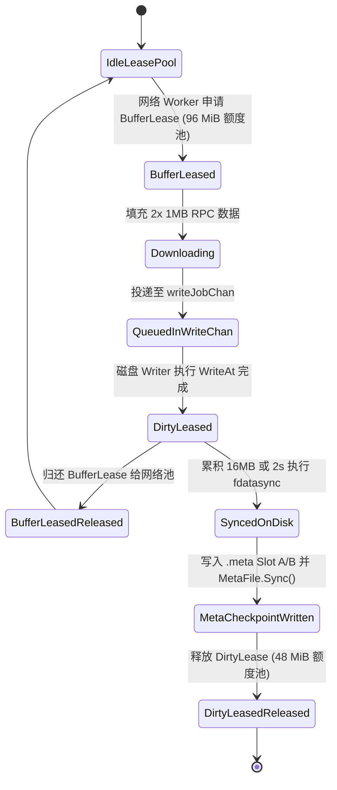

# Telegram Media Downloader 流式块存储引擎技术规范 (SBE v4.1 终极方案)
## Architecture & Production Technical Specification: Streaming Block Engine (SBE v4.1)

---

## 1. 文档结论与核心定调

SBE v4.1 采用下面这条单向解耦的主流水线：

1. **分片切分**：一个文件下载任务按固定大小（2 MiB）拆分为若干个顺序分片任务（ChunkTask）。
2. **受控拉流**：网络 Worker 必须在获取 `BufferLease`（全局 96 MiB 硬预算）后，拉取分片并填入内存块。
3. **任务转换**：下载完成的分片由网络 Worker 投递到无锁写入通道（`writeJobChan`）。
4. **顺序写盘**：固定 5 个磁盘 Writer 按物理卷和文件偏移将数据块通过 `WriteAt` 写入同目录临时文件（`.part`）。
5. **背压与持久化**：写入后立即释放 `BufferLease` 并申请 `DirtyLease`（全局 48 MiB 预算）；数据批次真正落盘（`fdatasync`）后，覆盖更新可恢复双槽侧车位图（`.meta`）并释放 `DirtyLease`。
6. **原子提交**：全部分片持久化完成后，临时文件通过 `RENAME_NOREPLACE` 原子重命名为最终文件，并更新 SQLite 为 `SUCCESS`。
7. **崩溃恢复**：进程重启时，根据 `.meta` 双槽校验结果仅重新下载尚未持久化的分片。

默认启动参数为 64 个逻辑网络 Worker 和 5 个逻辑磁盘 Writer。两者均为 Go 协程池，不等于 64 条 TCP 连接和 5 个物理磁盘请求。TCP/MTProto 连接跨分片、跨文件长期复用；磁盘实际并发受物理卷调度器控制。

---

## 2. 目标与边界约束

### 2.1 核心目标
- **网络并发打满**：海量小文件和分片可并发抢占 64 个网络拉流槽位，不再受活跃文件数量限制。
- **磁盘顺序写入**：网络多路拉流在写盘前按文件偏移归集，严禁将 64 路网络并发直接映射为磁盘随机 IO。
- **物理内存绝对锁定**：通过 `BufferLease (96 MiB)` + `DirtyLease (48 MiB)` 双额度租赁背压，将常驻内存（RSS）强力锁定在 200 MiB 以内，杜绝 OOM。
- **崩溃零数据损坏**：断电或进程强杀重启后，绝对不把未刷盘数据误判为成功，断点续传 0 毫秒对账。
- **零静默文件覆盖**：通过原子非覆盖重命名与回退链，杜绝文件名冲突导致的文件静默覆盖。

### 2.2 明确系统边界
- 单机单下载进程独占写入目录；进程启动时必须获取根目录文件锁（flock），未取得锁拒绝启动。
- 临时文件（`.part`）与最终文件必须位于同一文件系统，严禁跨物理分区 rename。
- SQLite 数据库仅保存文件级状态（`QUEUED` / `RUNNING` / `COMMITTING` / `SUCCESS` / `FAILED`），逐块进度由同目录侧车 `.meta` 持久化。
- 2 MiB 为存储与恢复单元，不是 MTProto RPC 单次请求大小（单次 RPC 严格对齐 1 MiB）。

---

## 3. 总体架构图解

```mermaid
flowchart TD
    DB[(SQLite Task DB)] --> Claim["任务调度与 FileCoordinator"]
    Claim --> Sched["DRR 双车道调度器 (Small : Large = 3:1)"]
    Sched --> ChunkQ["chunkChan (容量 128)"]

    subgraph NetworkStage ["网络拉流阶段"]
        ChunkQ --> AcquireBuf{"申请 BufferLease (上限 96 MiB)"}
        AcquireBuf -->|获取成功| NW["64 个网络 Worker"]
        NW --> Limit["账号 / DC / RPC 限流器"]
        Limit --> Conn["长期 MTProto Session (gotd)"]
        Conn -->|2x 1MB RPC| NW
        NW -->|组装 2MB 块| WriteQ["writeJobChan (容量 64)"]
    end

    subgraph DiskStage ["磁盘持久化阶段"]
        WriteQ --> DS["物理卷调度与 offset 归集"]
        DS --> AcquireDirty{"申请 DirtyLease (上限 48 MiB)"}
        AcquireDirty -->|获取成功| DW["5 个磁盘 Writer"]
        DW -->|WriteAt| Temp[".part 临时数据文件"]
        DW -->|释放 BufferLease| AcquireBuf
        Temp -->|累积 16MB 或 2s| SyncBatch["DataFile.Fdatasync()"]
        SyncBatch --> Checkpoint[".meta 双槽位图更新 (Slot A/B)"]
        Checkpoint -->|MetaFile.Sync()| ReleaseDirty["释放 DirtyLease"]
    end

    subgraph CommitStage ["原子提交流程"]
        ReleaseDirty -->|所有分片完成| CommittingState["SQLite 状态 -> COMMITTING"]
        CommittingState --> AtomicRename{"Linux Renameat2 (NOREPLACE)"}
        AtomicRename -->|不支持| LinkFallback["linkat(temp, final) + unlink(temp)"]
        AtomicRename -->|成功| FsyncDir["fsync 父目录"]
        LinkFallback -->|成功| FsyncDir
        FsyncDir --> SuccessState["SQLite 状态 -> SUCCESS"]
        SuccessState --> CleanupMeta["清理 .meta 文件并 fsync 父目录"]
    end
```

---

## 4. 数据结构与生命周期

### 4.1 核心数据结构

```go
type SourceRef struct {
    AccountID int64
    PeerID    int64
    MessageID int64
    MediaID   string
    DCHint    int
}

type FileTask struct {
    FileKey     string
    AttemptID   string
    Source      SourceRef
    TotalSize   int64
    BlockSize   int64
    TotalBlocks uint32
    FinalPath   string
    TempPath    string
    MetaPath    string
}

type ChunkTask struct {
    FileKey    string
    AttemptID  string
    ChunkIndex uint32
    Offset     int64
    Length     int
}

type WriteJob struct {
    FileKey    string
    AttemptID  string
    ChunkIndex uint32
    Offset     int64
    Length     int
    Buffer     *BufferLease // 持有真实 2MB 用户态内存
}
```

`WriteJob` 不直接持有裸 `*FileCoordinator`。磁盘 Worker 通过 `FileKey + AttemptID` 从 Registry 获取活动句柄；若 AttemptID 不匹配，则丢弃该块并立即释放 `BufferLease`，防止过期分片污染新文件。

---

## 5. 公平调度与网络拉流

### 5.1 Small / Large 双车道加权调度 (DRR)
- **Small Lane**：文件大小 $\le 10\text{ MiB}$，采用单块或少量块拉流，快速轮转释放网络槽位。
- **Large Lane**：文件大小 $> 10\text{ MiB}$，并发在途大文件上限为 12~16 个，单个大文件并发分片上限为 4 个。
- **加权调度**：调度器按 `Small : Large = 3 : 1` 差额轮询（DRR），保证小文件即到即走，同时大文件平稳下载。

### 5.2 MTProto 连接复用与 1MB RPC 切分
- 64 个逻辑 Worker 跨文件、跨分片长期复用按 `(AccountID, DCID)` 维护的 gotd 客户端连接池。
- 1 个 2 MiB 存储块固定拆分为 **2 次连续的 1 MiB（1,048,576 字节）`upload.getFile` RPC** 请求拉取，并在内存中完成组装。
- 遇 `FloodWait` 时，精准挂起该账号/DC 的调度队列至 `notBefore`，释放其占用的 `BufferLease`，将未完成分片退回调度队列。

---

## 6. 有界内存与双额度租赁模型



1. **BufferBudget (96 MiB)**：
   - 对应全局最多流通 $96 / 2 = 48$ 个满载 2MB 块。
   - 64 个 Worker 和 16 个并发大文件（每文件 4 块上限）代表调度上限。当 48 个 Lease 被占满时，多余 Worker 在 `sync.Cond` 上阻塞等待，形成精确流控背压。
2. **DirtyBudget (48 MiB)**：
   - 限制用户态已调用 `WriteAt` 但尚未调用 `fdatasync` 的脏数据总量。
   - 当脏数据积压达到 48 MiB 时，磁盘调度器暂停接单并强制触发数据落盘与位图 Checkpoint。

---

## 7. 磁盘写入、侧车文件与 Checkpoint

### 7.1 侧车文件格式（.meta）与动态预分配
大文件（$> 2\text{ MiB}$）初始化时必须在同目录下创建并预分配 `.meta` 文件（单块小文件不生成 `.meta`）。

* **尺寸计算公式**：
  $$\text{MetaSize} = \text{Header}(64\text{B}) + 2 \times \Big(\text{SlotHeader}(32\text{B}) + \lceil \text{TotalBlocks} / 8 \rceil \text{B}\Big)$$
* **初始化落盘时序**：
  ```text
  创建 .meta 临时文件
  -> 写入文件 Header (Magic, Version, TotalBlocks, BlockSize, FileSize)
  -> 写入初始无效的 Slot A 和 Slot B (Generation=0, Valid=0)
  -> MetaFile.Sync()
  -> fsync 父目录
  ```
* **定点覆盖写入**：后续 Checkpoint 仅通过 `WriteAt` 覆写固定物理偏移处的 Slot A（偏移 64）或 Slot B（偏移 $64 + \text{SlotSize}$），无需动态调整文件尺寸。

### 7.2 Group Checkpoint 严格落盘时序
每文件累计脏数据达 16 MiB 或间隔满 2 秒时触发：
```text
1. 内存中快照已写入位图 (WrittenBitmap)
2. DataFile.Fdatasync() 物理数据落盘
3. 将 nextDurable 写入 .meta 的下一代槽位 (Slot A 或 Slot B)，并计算 CRC32
4. MetaFile.Sync() 确保位图落盘
5. 推进内存中的 DurableBitmap
6. 释放该批次占用的 DirtyLease
```

---

## 8. 原子提交协议与非覆盖重命名

### 8.1 多块大文件提交流程
```text
1. 校验 DurableBitmap 全满且 activeWrites == 0
2. SQLite 事务：RUNNING -> COMMITTING (以 FileKey + AttemptID 唯一匹配)
3. DataFile.Sync() 与 MetaFile 写入 COMPLETE 标记并 Sync()
4. 关闭 DataFile 与 MetaFile 句柄
5. 执行非覆盖原子提交：
   a. 主路径：unix.Renameat2(parentDirFD, tempName, parentDirFD, finalName, unix.RENAME_NOREPLACE)
   b. 若返回 ENOSYS / EINVAL / EOPNOTSUPP，进入回退链：
      linkat(parentDirFD, tempName, parentDirFD, finalName, 0) -> unlinkat(parentDirFD, tempName, 0)
   c. 若仍不支持或发生 EEXIST，明确报错，严禁降级为 os.Rename
6. fsync 父目录文件描述符
7. SQLite 事务：COMMITTING -> SUCCESS
8. 删除 .meta 文件并再次 fsync 父目录
```

### 8.2 单块小文件提交流程
```text
唯一 Attempt 临时文件
-> 精确 WriteAt(buf[:n]) 严格按真实有效长度写入
-> DataFile.Sync()
-> Close DataFile
-> SQLite 事务：RUNNING -> COMMITTING
-> Renameat2 (RENAME_NOREPLACE) [带 linkat 回退链]
-> fsync 父目录 (默认逐文件严格同步；高频目录支持 COMMITTING 保护的 Group Dir Sync 批聚合)
-> SQLite 事务：COMMITTING -> SUCCESS
```

---

## 9. 崩溃对账与启动恢复矩阵

进程重启或崩溃拉起后，针对下载目录中的文件执行确定性对账：

| SQLite 状态 | 最终文件存在 | `.part` 存在 | `.meta` 状态 | 恢复判定与动作 |
| :--- | :--- | :--- | :--- | :--- |
| `SUCCESS` | 是 | 否 | 否 | **已完成**：正常跳过 |
| `COMMITTING` | 是 | 否 | 任意 | **提交流程崩溃**：直接对账推进 SQLite 为 `SUCCESS`，清理残余 `.meta` |
| `COMMITTING` | 否 | 是 | 校验完整 | **提交前崩溃**：重新触发原子重命名与目录 fsync，更新 SQLite 为 `SUCCESS` |
| `RUNNING` | 否 | 是 | 双槽 CRC 有效 | **断点续传**：根据最新合法 Generation 槽位加载 `DurableBitmap`，仅下载未完成块 |
| `RUNNING` | 否 | 是 | 双槽损坏/不存在 | **位图损坏**：重置 `.meta` 和 `.part`，重新从第 0 块开始下载 |
| 任意 | 是 (哈希不符) | 任意 | 任意 | **路径冲突/被篡改**：报错告警，严禁覆盖 |

---

## 10. 默认生产配置参数表

| 参数项 | 默认值 | 设计依据与说明 |
| :--- | :---:| :--- |
| **StorageBlockSize** | **2 MiB** | 存储与断点单元，末块按实际长度裁剪 |
| **RPCPartSize** | **1 MiB** | Telegram MTProto 标准单次请求对齐尺寸 |
| **NetworkWorkers** | **64** | 逻辑网络拉流协程数（复用 MTProto 长期连接） |
| **DiskWorkers** | **5** | 全局逻辑 Writer 协程数，按物理卷限流 |
| **BufferBudget** | **96 MiB** | 用户态数据缓冲区硬上限（最多流通 48 个 2MB 块） |
| **DirtyBudget** | **48 MiB** | 未刷盘脏数据硬上限，达到即触发强制落盘 |
| **ActiveLargeFiles** | **12~16** | 全局同时激活的大文件会话池上限 |
| **LargeInflight** | **4** | 单个大文件最大并行在途分片数 |
| **Small/Large DRR** | **3 : 1** | 小文件与大文件加权调度比 |
| **CheckpointBytes** | **16 MiB** | 触发单文件 `fdatasync` 的累计数据量阈值 |
| **CheckpointInterval** | **2 秒** | 触发单文件 `fdatasync` 的最大时间延迟 |
