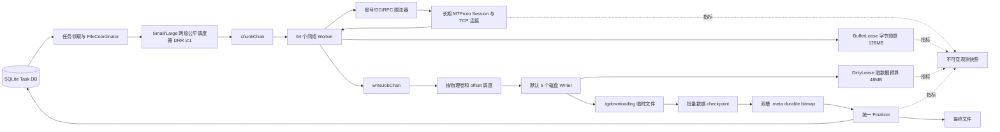

# Telegram Media Downloader 流式块存储引擎技术规范 (SBE v4.1 终极方案)
## Architecture & Production Technical Specification: Streaming Block Engine (SBE v4.1)

---

## 1. 文档结论

SBE v4.1 采用下面这条主流水线：

1. 一个文件下载任务被拆成多个固定大小（2 MiB）的分片任务。
2. 网络 Worker 下载分片，填充受控的内存块（BufferLease）。
3. 下载完成的分片被转换为文件块写入任务（WriteJob）。
4. 磁盘 Writer 按物理卷和文件偏移把块写入同目录临时文件（.tgdownloading）。
5. 数据批次真正落盘（`fdatasync`）后，才把对应块写入可恢复双槽位图（.meta）。
6. 全部分片持久化完成后，临时文件通过严格的原子提交协议提交为最终文件，并更新 SQLite。
7. 进程重启时，只重新下载尚未持久化的分片。

默认启动参数为 64 个逻辑网络 Worker 和 5 个逻辑磁盘 Writer。两者均为 Go 协程池，不等于 64 条 TCP 连接和 5 个物理磁盘请求。TCP/MTProto 连接跨分片、跨文件长期复用；磁盘实际并发还要受物理卷调度器控制。

本方案面向单机、单下载进程、Linux NAS。SQLite 数据库必须位于本机支持 WAL 的文件系统；临时文件与最终文件必须位于同一文件系统。

---

## 2. 目标与边界

### 2.1 要解决的问题
- 海量小文件能够使用足够的网络并发，不再受少量活跃文件限制。
- 大文件可以并行下载，但不会把 64 路网络并发直接转换为 64 路随机磁盘写。
- 网络、内存和磁盘速度不一致时，有明确且可计算的双额度背压（BufferLease + DirtyLease）。
- 异常退出后能够继续下载，不能把尚未落盘的数据误判为已完成。
- 最终文件、断点文件和 SQLite 状态能够在重启后收敛到一致结果。
- 一个 TCP/MTProto 连接可以连续服务大量分片和文件，不为每个 2 MiB 分片重新建连。

### 2.2 明确边界
- 不支持多个进程或多台机器同时写同一个下载根目录。
- 进程启动时必须取得下载根目录的单实例锁；未取得锁就拒绝启动写入流水线。
- 不允许临时文件跨文件系统 rename 到最终目录。
- 不静默覆盖已经存在的最终文件（采用 `no-replace rename` 系统调用）。
- SQLite 不保存逐块进度；逐块进度由同目录侧车 `.meta` 文件保存。
- 2 MiB 是存储和恢复单位，不是 TCP 连接生命周期，也不是单次 RPC 的固定长度。

---

## 3. 总体架构



核心上把“任务并发、连接数量、内存块数量、磁盘并发”拆成四个独立控制面：

| 控制对象 | 作用 | 默认策略 |
|---|---|---|
| **网络 Worker** | 同时处理多少逻辑分片 | 64 个协程 |
| **MTProto/TCP 连接** | 承载 RPC | 按账号和 DC 长期复用，不与 Worker 一一对应 |
| **BufferLease** | 限制用户态数据缓冲 | 按真实容量计费的有界池（默认 128 MiB） |
| **DirtyLease** | 限制 WriteAt 后尚未 checkpoint 的数据 | 按物理卷计费（默认 48 MiB） |
| **磁盘 Writer** | 执行文件写调用 | 全局默认 5，按物理卷进一步限流和排序 |

---

## 4. 文件、分片与数据结构

### 4.1 数据结构定义

```go
type SourceRef struct {
    AccountID int64
    PeerID    int64
    MessageID int64
    MediaID   string
    DCHint    int
}

type FileTask struct {
    FileKey     string
    AttemptID   string
    Source      SourceRef
    TotalSize   int64
    BlockSize   int64
    FinalPath   string
}

type ChunkTask struct {
    FileKey    string
    AttemptID  string
    ChunkIndex uint32
    Offset     int64
    Length     int
}

type WriteJob struct {
    FileKey    string
    AttemptID  string
    ChunkIndex uint32
    Offset     int64
    Length     int
    Buffer     *BufferLease
}
```

`WriteJob` 不长期持有裸 `*FileCoordinator`。磁盘层通过 `FileKey + AttemptID` 查找当前 Coordinator；查不到或代次不匹配时丢弃任务并释放 BufferLease，禁止旧任务写入新文件。

---

## 5. 公平调度与网络拉流

### 5.1 Small / Large 双车道调度
- **Small lane**：$\le 2\text{ MiB}$，每个文件一个块。保持充足的 runnable 文件数，跑满 64 网络并发。
- **Large lane**：$> 2\text{ MiB}$，同时打开的大文件默认不超过 12~16 个。
- 两条 lane 使用加权 DRR（Deficit Round Robin），初始权重为 `Small : Large = 3 : 1`。

### 5.2 长期连接复用与 1MB MTProto RPC
- 64 个 Worker 共享按 `(AccountID, DCID)` 维护的长期 gotd Session / Sender。
- 1 个 2 MiB 存储块由网络 Worker 循环执行 **2 次 1 MiB MTProto RPC** 子请求填满。
- `FloodWait` 视为正常调度反馈，暂停对应账号/DC 到 `notBefore`，释放内存额度并将 Chunk 放回延迟队列。

---

## 6. 有界内存与双额度租赁

1. **BufferBudget（默认 128 MiB）**：所有网络和写队列持有的用户态数据块总容量。
2. **DirtyBudget（默认 48 MiB）**：已经 WriteAt、但尚未通过数据 checkpoint 的字节总量。
3. **流转机制**：
   - 网络 Worker 拉流前申请 `BufferLease`；
   - 投递给磁盘 Writer 后所有权转移；
   - Writer 执行 `WriteAt` 后释放 `BufferLease`，同时申请 `DirtyLease`；
   - 数据批次 `fdatasync` 完成后释放 `DirtyLease`。

---

## 7. 磁盘写入、侧车文件与 Group Checkpoint

### 7.1 侧车文件格式（.meta）
大于 1 个块的文件使用 `.meta` 侧车文件（单块小文件不生成 `.meta`）。
创建时一次性预分配固定大小（512 字节），包含 Header 与 Slot A / Slot B 双槽快照及 CRC 校验。

### 7.2 Group Checkpoint 严格落盘时序
每文件累计 16 MiB 或等待 2 秒时触发：
```text
1. 快照本次需要提交的 WrittenBitmap 位集合
2. DataFile.Fdatasync() 物理数据刷盘
3. 将 nextDurable 写入 .meta 的下一代快照槽 (Slot A 或 Slot B)
4. MetaFile.Sync() 刷入位图
5. 更新内存 DurableBitmap
6. 释放该批次对应的 DirtyLease
```

---

## 8. 原子提交协议与非覆盖重命名

### 8.1 多块文件提交链
```text
1. 确认 DurableBitmap 全满且 activeWrites == 0
2. SQLite: RUNNING -> COMMITTING (按 FileKey + AttemptID 唯一匹配)
3. DataFile.Sync() 与 MetaFile 写 COMPLETE
4. Close DataFile 与 MetaFile
5. Linux 原生 no-replace Rename (使用 renameat2 RENAME_NOREPLACE 防误覆盖)
6. fsync 父目录
7. SQLite: COMMITTING -> SUCCESS
8. 删除 .meta 并再次 fsync 父目录
```

### 8.2 单块小文件提交链
```text
唯一 attempt temp
-> 精确 WriteAt
-> DataFile.Sync()
-> Close
-> SQLite: RUNNING -> COMMITTING
-> no-replace Rename
-> fsync 父目录 (高频小文件支持 Group Dir Sync 批聚合)
-> SQLite: COMMITTING -> SUCCESS
```

---

## 9. 默认核心参数表

| 参数 | 初始默认值 | 说明 |
|---|---:|---|
| **StorageBlockSize** | **2 MiB** | 尾块使用实际长度 |
| **RPCPartSize** | **1 MiB** | Telegram MTProto 标准分片 |
| **NetworkWorkers** | **64** | 逻辑拉流协程数 |
| **DiskWorkers** | **5** | 全局逻辑 Writer，按物理卷限流 |
| **BufferBudget** | **128 MiB** | 用户态数据缓冲硬上限 |
| **DirtyBudget** | **48 MiB** | 内核未刷盘脏页硬上限 |
| **ActiveLargeFiles** | **12** | 大文件并发激活池 |
| **LargeInflight** | **4** | 单个大文件初始在途分片数 |
| **Small/Large DRR** | **3 : 1** | 小文件与大文件调度加权 |
| **CheckpointBytes** | **16 MiB** | 触发 fdatasync 的数据量阈值 |
| **CheckpointInterval** | **2 秒** | 触发 fdatasync 的时间阈值 |

---

## 10. 验收与对账标准

- **数据正确性**：覆盖 0 字节、1 字节、1MB、2MB 边界与大视频，逐字节强哈希一致。
- **内存零 OOM**：BufferLease + DirtyLease 严格受控，300MB 容器绝对不发生 OOM。
- **断电恢复一致性**：在任何步骤 kill -9 重启，根据启动恢复矩阵自动收敛，绝无脏数据残留。
