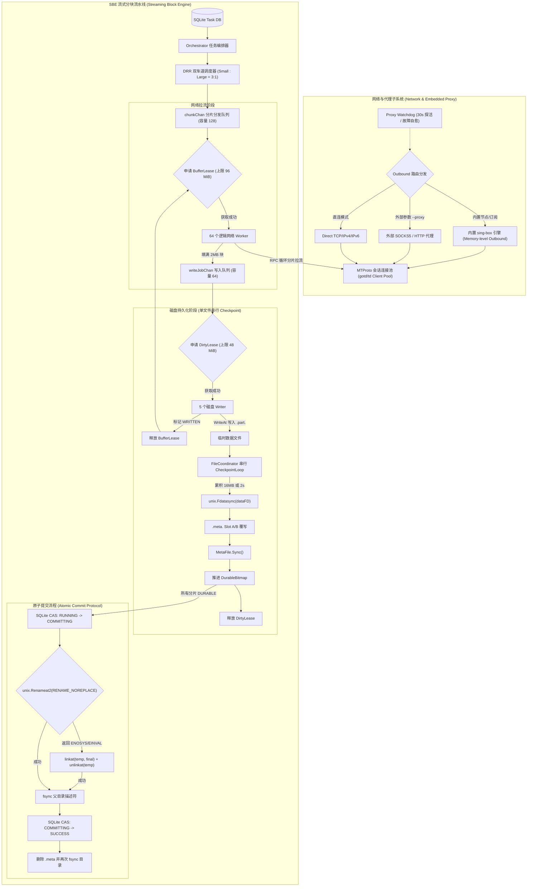
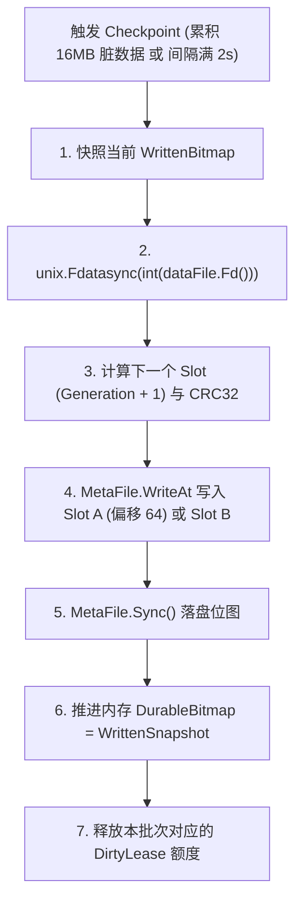

# TG_Downloader 系统架构与技术实现规范
## Master Architecture & Production Technical Specification (SBE Engine & Embedded sing-box)

---

## 1. 架构定位与系统边界

### 1.1 系统定位
**TG_Downloader** 是专为大规模 Telegram 媒体 7x24h 自动化归档、高吞吐下载与 NAS / Linux 服务器部署而设计的工业级 Go 原生流式下载引擎与守护服务。系统主要由两大核心子系统构成：

1. **Streaming Block Engine (SBE 流式分块存储引擎)**：
   - 将网络拉流与磁盘写入物理完全解耦，消除传统顺序下载导致的带宽断流与磁盘瓶颈；
   - 实行严格的双额度内存租赁背压（`BufferLease` 96 MiB + `DirtyLease` 48 MiB），通过流控信号量杜绝内存无界膨胀；
   - 实行 Small / Large 双车道加权差额轮询调度（DRR 3:1），保障海量小文件秒级流转与大文件平稳吞吐；
   - 实行 Attempt 绑定的侧车预分配双槽位图（`.meta`）与单写者 Checkpoint，保障高抗崩溃能力与精确断点续传；
   - 实行 Linux `RENAME_NOREPLACE` 与 `linkat` 回退链的原子提交协议，杜绝同名文件静默覆盖。
2. **Embedded sing-box Engine (内置网络驱动与代理看门狗)**：
   - 原生集成 `sing-box` 核心库，在 Go 进程内部直接初始化 Outbound 实例，消除本地 127.0.0.1 Loopback 握手开销；
   - 支持 Shadowsocks、VMess、VLESS (Reality)、Trojan、Hysteria2、TUIC、WireGuard 等主流全协议；
   - 提供 Web 控制台可视化节点与订阅管理；
   - 配合 Proxy Watchdog 实现 30 秒自动心跳探活与故障自愈转移，同时保留对外部 SOCKS5/HTTP 代理的兼容。

### 1.2 系统边界与运行前提
- **单机单进程独占**：下载根目录由单实例通过 `flock` 文件锁独占写入，未取得锁拒绝启动。
- **同一物理分区**：临时数据文件（`.part`）与最终下载目标目录必须位于同一文件系统，严禁跨物理分区 rename。
- **状态分离原则**：SQLite 负责全局任务生命周期与元数据持久化，逐块下载进度由同目录的 `.meta` 侧车文件独立承担。
- **零静默覆盖**：当目标路径已存在文件时，必须通过原子非覆盖重命名阻断，绝不允许覆盖已有数据。

---

## 2. 总体架构拓扑



---

## 3. 网络拉流与 RPC 分片组装

### 3.1 存储分块与 RPC 实际返回循环
- **存储块尺寸**：标准块大小 `BlockSize = 2 MiB`（2,097,152 字节），尾块按实际文件剩余字节对齐。
- **动态循环填充规则**：网络 Worker 在拉取分片时，不固定假设“两次 RPC 必然填满 2 MiB”，而是按实际返回长度累加，确保处理短读、尾块和网络截断：
  ```text
  while filled < ChunkTask.Length:
      partLength = min(1 MiB, ChunkTask.Length - filled)
      reqOffset = ChunkTask.Offset + filled
      resBytes = client.UploadGetFile(reqOffset, partLength)
      
      if len(resBytes) == 0:
          return EOFError / NetworkInterrupt
          
      copy(leasedBuffer[filled:], resBytes)
      filled += len(resBytes)

  // 严格验证：只有当 filled == ChunkTask.Length 时才生成 WriteJob
  ```

### 3.2 异常重试与协议自愈
- **`FILE_REFERENCE_EXPIRED`**：当 Telegram 媒体引用过期时，网络 Worker 捕获该错误，通知 `FileCoordinator` 调用 `RefreshFileReference` 重新拉取最新消息元数据，原地更新引用并重试，无需重置整个任务。
- **`DC_MIGRATE_X` 与 CDN Redirect**：自动触发连接池对目标 DC 的长连接握手，迁移拉流通道。
- **`FloodWait`**：精准挂起对应 `(AccountID, DCID)` 队列至 `notBefore`，释放当前分片持有的 `BufferLease`，将 `ChunkTask` 退回调度延迟队列。

---

## 4. 内置 sing-box 网络驱动与 Proxy Watchdog

### 4.1 In-Process sing-box 架构
- 系统引入 `pkg/proxy/singbox` 模块，直接调用 `github.com/sagernet/sing-box/box`。
- **Direct DialContext 注入**：将 sing-box Outbound 的 `DialContext` 直接注入到 `gotd/td` 客户端的底层 TCP Transport 中：
  ```go
  instance, err := box.New(box.Options{
      Options: optionOptions,
      Context: ctx,
  })
  dialer := instance.Outbound()
  client := telegram.NewClient(appID, appHash, telegram.Options{
      Resolver: dialer,
      // ...
  })
  ```
- **内存零开销**：消除本地 SOCKS5 握手往返与内核 TCP 栈多次拷贝。

### 4.2 Proxy Watchdog 故障自愈机制
- **心跳探活**：后台协程每 30 秒向 Telegram DC 探活端口或公网目标发起轻量 TCP/TLS 心跳；
- **故障转移 (Failover)**：当连续 2 次探活超时或 MTProto 产生不可恢复连接阻断时，在 30 秒内自动执行确定性轮询（Round-Robin Failover），平滑切换至下一可用节点；
- **指标持久化**：内存与 SQLite 记录各节点 24 小时延迟、握手成功率与下载速率基线。

---

## 5. 有界内存与双额度租赁模型


### 5.1 租赁额度与背压流控
1. **`BufferBudget` (96 MiB)**：
   - 限制用户态数据缓冲总量，对应最多流通 $96 / 2 = 48$ 个满载 2MB 块；
   - 采用带 Context 取消与超时支持的加权信号量（Weighted Semaphore）。当 48 个 Lease 被占满时，多余的 Worker 协程被挂起等待，产生精确网络背压。
2. **`DirtyBudget` (48 MiB)**：
   - 限制已调用 `WriteAt` 但尚未调用 `fdatasync` 的未落盘脏数据总量；
   - **严格时序**：磁盘 Writer **必须在执行 `WriteAt` 前** 成功申请 `DirtyLease(Length)`；写入完成后立即释放 `BufferLease`；落盘完成后释放 `DirtyLease`。

---

## 6. 磁盘写入、.meta 侧车文件与单写者 Checkpoint

### 6.1 .meta Header 身份与 Attempt 强绑定
为杜绝把同大小旧文件的残余位图误用到新任务上，`.meta` 文件 Header 必须与文件身份和 Attempt 强绑定：

```go
type MetaHeader struct {
    Magic             [4]byte  // 固定为 "SBM1"
    Version           uint32   // 协议版本，当前为 1
    FileKeyHash       [32]byte // SHA256(FileKey)
    SourceFingerprint uint64   // PeerID ^ MessageID ^ MediaIDHash
    AttemptID         [16]byte // 当前下载 Attempt 的 UUID
    TotalSize         int64    // 文件总字节数
    BlockSize         uint32   // 块大小 (2,097,152)
    TotalBlocks       uint32   // 总分块数
    HeaderCRC         uint32   // Header 前序字段的 IEEE CRC32 校验和
}
```

- **文件名规范**：
  - 临时数据文件：`<TargetDir>/<FileName>.part.<AttemptID>`
  - 侧车位图文件：`<TargetDir>/<FileName>.meta.<AttemptID>`
- **文件尺寸精确预分配**：
  $$\text{MetaSize} = \text{Header}(64\text{B}) + 2 \times \Big(\text{SlotHeader}(32\text{B}) + \lceil \text{TotalBlocks} / 8 \rceil \text{B}\Big)$$
  初始化时一次性写入完整 Header 与初始无效的 Slot A / Slot B，执行 `MetaFile.Sync()` 与父目录 `fsync` 后固定尺寸，后续仅定点覆写。

### 6.2 单写者 CheckpointLoop（串行无锁落盘）
每个 `FileCoordinator` 拥有唯一的串行 `CheckpointLoop`，彻底杜绝多个磁盘 Writer 竞态修改 BitSet、Generation 和 Slot：



- **分块状态机**：每个分块生命周期严格遵循：`MISSING → INFLIGHT → WRITTEN → DURABLE`。已进入 `WRITTEN` 或 `DURABLE` 的分块拒绝重复写入与重复扣减额度。

---

## 7. 原子提交协议与非覆盖重命名

### 7.1 大文件提交流程
```text
1. 校验 DurableBitmap 全满且 activeWrites == 0
2. SQLite 乐观 CAS 事务：
   UPDATE tasks SET state = 'COMMITTING' 
   WHERE file_key = ? AND attempt_id = ? AND state = 'RUNNING';
   (严格校验 RowsAffected == 1，否则终止并重试)
3. dataFile.Sync() 确保尾部数据落盘
4. metaFile 写入 COMPLETE 标记槽并 MetaFile.Sync()
5. 关闭 dataFile 与 metaFile 描述符句柄
6. 执行非覆盖原子提交：
   a. 主路径：unix.Renameat2(parentDirFD, tempPartName, parentDirFD, finalName, unix.RENAME_NOREPLACE)
   b. 若返回 ENOSYS / EINVAL / EOPNOTSUPP，进入安全回退链：
      linkat(parentDirFD, tempPartName, parentDirFD, finalName, 0)
      -> unlinkat(parentDirFD, tempPartName, 0)
   c. 若仍不支持或返回 EEXIST (目标已存在)：明确报错阻断，严禁降级为 os.Rename
7. fsync 父目录文件描述符
8. SQLite 乐观 CAS 事务：
   UPDATE tasks SET state = 'SUCCESS' 
   WHERE file_key = ? AND attempt_id = ? AND state = 'COMMITTING';
9. 删除 .meta.<AttemptID> 侧车文件并再次 fsync 父目录
```

### 7.2 单块小文件提交流程
```text
唯一 Attempt 临时文件 (.part.<AttemptID>)
-> 严格按有效长度 WriteAt 写入
-> dataFile.Sync()
-> 关闭 dataFile
-> SQLite CAS: RUNNING -> COMMITTING
-> unix.Renameat2 (RENAME_NOREPLACE) [带 linkat 回退链]
-> fsync 父目录 (默认单文件严格同步；高频场景支持带 COMMITTING 保护的 Group Dir Sync 批聚合)
-> SQLite CAS: COMMITTING -> SUCCESS
```

---

## 8. 崩溃对账与启动恢复矩阵

服务拉起或异常重启后，恢复器根据 SQLite 当前 Attempt 与文件系统物理状态进行严格对账：

| SQLite 状态 | 最终文件 | `.part.<Attempt>` | `.meta.<Attempt>` | 判定结果与自愈动作 |
| :--- | :--- | :--- | :--- | :--- |
| `SUCCESS` | 存在 | 不存在 | 不存在 | **正常完成**：直接跳过 |
| `COMMITTING` | 存在 | 不存在 | 存在有效 COMPLETE | **提交流程崩溃**：执行父目录 `fsync`，补交 SQLite 推进为 `SUCCESS`，清理残余 `.meta` |
| `COMMITTING` | 存在且与 part inode 相同 | 存在 | 任意 | **linkat 成功但 unlink 崩溃**：执行 `unlinkat(part)`，`fsync` 目录，推进 `SUCCESS` |
| `COMMITTING` | 存在但与 part inode 不同 | 存在 | 任意 | **路径严重冲突**：拒绝成功，记录 `PATH_CONFLICT` 错误并告警 |
| `COMMITTING` | 不存在 | 存在 | 校验完整 | **提交前崩溃**：重新执行原子重命名与目录 `fsync`，推进 SQLite 为 `SUCCESS` |
| `RUNNING` | 不存在 | 存在 | 双槽 CRC 有效 | **断点续传**：加载最新合法 Generation 槽位的 `DurableBitmap`，仅下载未完成块 |
| `RUNNING` | 不存在 | 存在 | 双槽损坏/不存在 | **位图损坏**：重置 `.meta` 和 `.part`，从第 0 块重新拉流 |
| 任意 | 存在 (哈希冲突) | 任意 | 任意 | **外部同名文件存在**：记录 `FILE_ALREADY_EXISTS`，拒绝覆盖已有文件 |

---

## 9. 核心生产参数配置表

| 参数项 | 生产默认值 | 设计依据与说明 |
| :--- | :---:| :--- |
| **StorageBlockSize** | **2 MiB** | 存储与断点续传单位，末块按实际长度裁剪 |
| **RPCPartSize** | **1 MiB** | Telegram MTProto 标准单次请求对齐尺寸 |
| **NetworkWorkers** | **64** | 逻辑网络拉流协程数（跨文件复用 MTProto 长期会话） |
| **DiskWorkers** | **5** | 全局磁盘 Writer 协程数，按物理卷限流 |
| **BufferBudget** | **96 MiB** | 用户态数据缓冲区硬上限（最多流通 48 个 2MB 满载块） |
| **DirtyBudget** | **48 MiB** | 未刷盘脏数据硬上限，达到即暂停写盘并强制 Checkpoint |
| **ActiveLargeFiles** | **12~16** | 全局同时激活的大文件会话池上限（单文件并发初始为 4，单大文件时自适应增加） |
| **Small/Large DRR** | **3 : 1** | 小文件与大文件加权调度比 |
| **CheckpointBytes** | **16 MiB** | 触发单文件 `fdatasync` 的累计脏数据量阈值 |
| **CheckpointInterval** | **2 秒** | 触发单文件 `fdatasync` 的最大时间延迟 |
| **ProxyWatchdogInterval**| **30 秒** | 内置 sing-box / 代理心跳探活与故障转移周期 |
