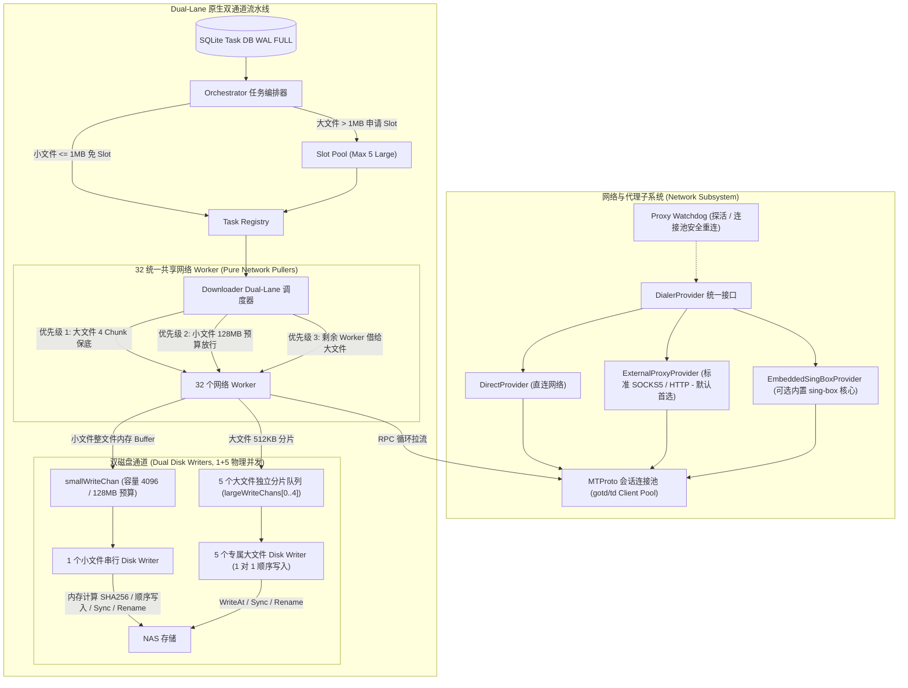

# TGX 系统架构与技术实现规范 (Master Specification)
## TGX Architecture & Production Technical Specification: Dual-Lane Streaming Engine & Network Subsystem

---

## 1. 架构定位与系统边界

### 1.1 系统定位
**TGX** 是专为大规模 Telegram 媒体 7x24h 自动化归档、高吞吐下载与 NAS / Linux 服务器部署而设计的工业级 Go 原生流式下载引擎与守护服务。系统主要由两大解耦子系统构成：

1. **Dual-Lane 原生双通道流式存储引擎**：
   - 将网络拉流与磁盘写入物理完全解耦，消除传统顺序下载导致的带宽断流与磁盘瓶颈；
   - **小文件通道（$\le 1\text{ MiB}$）**：1 个网络 Worker 完整拉取至内存，128 MiB 独立隔离内存预算，并在内存中计算 SHA256，严格由 1 个专属磁盘 Writer 串行执行落盘、sync 与重命名，彻底消除机械硬盘海量小文件随机写寻道风暴；
   - **大文件通道（$> 1\text{ MiB}$）**：严格限制最大活跃大文件数（默认 5），为每个活跃大文件保底 4 个在途分片（512 KiB/块），每个活跃大文件绑定专属磁盘 Writer 保证单文件块写入严格有序；
   - **自适应动态 FloodGate 风控**：默认 40.0 req/s，burst 10，在触发 Telegram FloodWait 时自适应阶梯降频退避，并在冷却后渐进恢复；
   - **双 DC 授权分流**：管理通道（对话与消息检索）严格走主连接鉴权，数据通道（分片下载）全面启用 32 条并发连接池；
   - 实行 Linux `RENAME_NOREPLACE` 与 `linkat` 回退链的原子提交协议，杜绝同名文件静默覆盖。
2. **Network & Proxy Provider Subsystem (网络与代理适配子系统)**：
   - 抽象统一的 `DialerProvider` 接口，提供 `DirectProvider`、`ExternalProxyProvider`（默认标准 SOCKS5/HTTP）与可选的 `EmbeddedSingBoxProvider`（进程级内置 sing-box 核心）；
   - 配合 Proxy Watchdog 实现自动心跳探活、指标持久化与 gotd 会话连接池安全重连。

### 1.2 系统边界与运行前提
- **单机单进程独占**：下载根目录由单实例通过 `flock` 文件锁独占写入，未取得锁拒绝启动。
- **同一物理分区**：临时数据文件（`.part`）与最终下载目标目录必须位于同一文件系统，严禁跨物理分区 rename。
- **状态分离原则**：SQLite 负责全局任务生命周期与元数据持久化。
- **零静默覆盖**：当目标路径已存在文件时，必须通过原子非覆盖重命名阻断，绝不允许覆盖已有数据。
- **数据库掉电语义**：SQLite 必须显式配置为 WAL 模式与 `PRAGMA synchronous = FULL;`，所有状态变更事务严格断言 `RowsAffected == 1`。

---

## 2. 总体架构拓扑

---

## 3. 并发矩阵与资源规约

| 子系统 / 组件 | 物理并发数 | 缓冲区 / 预算上限 | 调度策略 | 磁盘写入模式 |
| :--- | :--- | :--- | :--- | :--- |
| **网络 Worker 池** | 32 Goroutines | 64 Network Jobs | 3 级优先级动态平衡 | 纯网络拉流，0 磁盘 I/O |
| **小文件通道** | 1 网络 Worker / 文件 | 128 MiB 独立内存隔离预算 | 整文件内存缓存 | 1 个专属磁盘 Writer 严格串行落盘/Sync/Rename |
| **大文件通道** | 4 ~ 32 分片 / 文件 | 5 个最大活跃大文件 | 4 Chunk 保底 + 剩余借调 | 5 个专属磁盘 Writer，每文件 1 对 1 顺序写 |
| **磁盘总物理并发** | **6 (1 小 + 5 大)** | 有界队列 (10 Large, 64 Small Ready, 4096 Spool) | 严格分流 | 零寻道冲突，完全规避磁盘随机寻道 |
| **FloodGate 风控** | 全局统一 Token Bucket | 40.0 req/s, burst 10 | 遇 FloodWait 阶梯降频与防抖 | 线程安全、冷却前置、事件驱动 |
