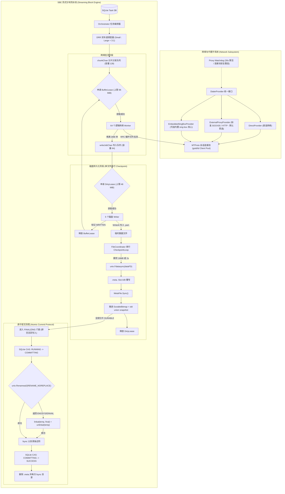
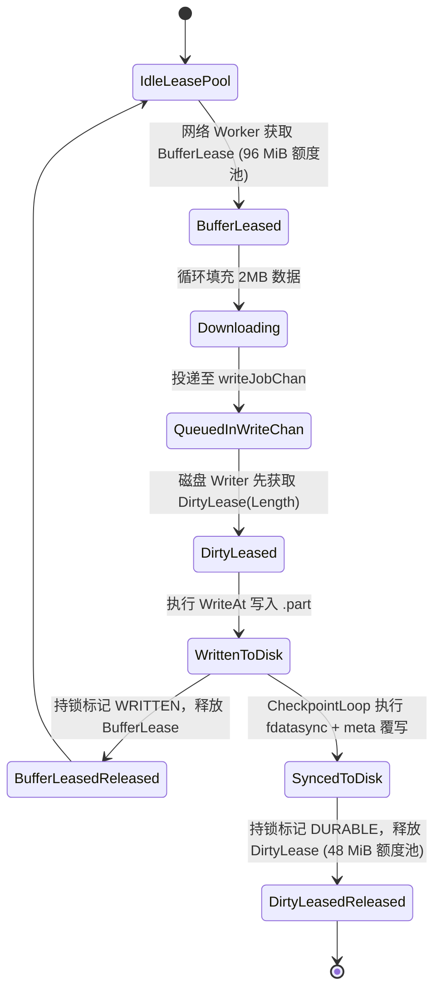
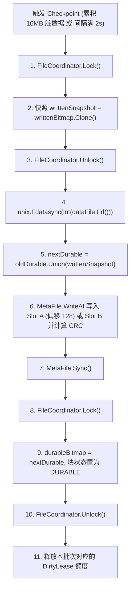
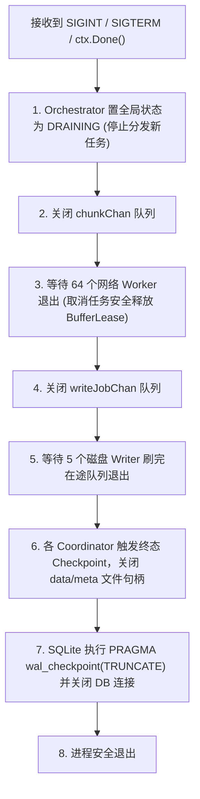

# TGX 系统架构与技术实现规范 (Master Specification)
## TGX Architecture & Production Technical Specification: SBE Engine & Network Subsystem

---

## 1. 架构定位与系统边界

### 1.1 系统定位
**TGX** 是专为大规模 Telegram 媒体 7x24h 自动化归档、高吞吐下载与 NAS / Linux 服务器部署而设计的工业级 Go 原生流式下载引擎与守护服务。系统主要由两大解耦子系统构成：

1. **Streaming Block Engine (SBE 流式分块存储引擎)**：
   - 将网络拉流与磁盘写入物理完全解耦，消除传统顺序下载导致的带宽断流与磁盘瓶颈；
   - 实行严格的双额度内存租赁背压（`BufferLease` 96 MiB + `DirtyLease` 48 MiB），通过流控信号量杜绝内存无界膨胀；
   - 实行 Small / Large 双车道加权差额轮询调度（DRR 3:1），保障海量小文件秒级流转与大文件平稳吞吐；
   - 实行全尺寸 Attempt 绑定的侧车预分配双槽位图（`.meta`）与单写者 Checkpoint，保障高抗崩溃能力与精确断点续传；
   - 实行 Linux `RENAME_NOREPLACE` 与 `linkat` 回退链的原子提交协议，杜绝同名文件静默覆盖。
2. **Network & Proxy Provider Subsystem (网络与代理适配子系统)**：
   - 抽象统一的 `DialerProvider` 接口，提供 `DirectProvider`、`ExternalProxyProvider`（默认标准 SOCKS5/HTTP）与可选的 `EmbeddedSingBoxProvider`（进程级内置 sing-box 核心）；
   - 配合 Proxy Watchdog 实现 30 秒自动心跳探活、指标持久化与 gotd 会话连接池安全重连。

### 1.2 系统边界与运行前提
- **单机单进程独占**：下载根目录由单实例通过 `flock` 文件锁独占写入，未取得锁拒绝启动。
- **同一物理分区**：临时数据文件（`.part`）与最终下载目标目录必须位于同一文件系统，严禁跨物理分区 rename。
- **状态分离原则**：SQLite 负责全局任务生命周期与元数据持久化，逐块下载进度由同目录的 `.meta` 侧车文件独立承担。
- **零静默覆盖**：当目标路径已存在文件时，必须通过原子非覆盖重命名阻断，绝不允许覆盖已有数据。

---

## 2. 总体架构拓扑



---

## 3. 网络拉流与 RPC 分片组装

### 3.1 存储分块与 RPC 实际返回循环
- **存储块尺寸**：标准块大小 `BlockSize = 2 MiB`（2,097,152 字节），尾块按实际文件剩余字节对齐。
- **动态循环填充规则**：网络 Worker 严禁假设“两次 RPC 必然填满 2 MiB”，必须按实际返回长度累加，以处理短读、尾块和网络截断：
  ```text
  while filled < ChunkTask.Length:
      partLength = min(1 MiB, ChunkTask.Length - filled)
      reqOffset = ChunkTask.Offset + filled
      resBytes = client.UploadGetFile(reqOffset, partLength)
      
      if len(resBytes) == 0:
          return EOFError / NetworkInterrupt
          
      copy(leasedBuffer[filled:], resBytes)
      filled += len(resBytes)

  // 严格验证：只有当 filled == ChunkTask.Length 时才生成 WriteJob
  ```

### 3.2 异常重试与协议自愈
- **`FILE_REFERENCE_EXPIRED`**：当 Telegram 媒体引用过期时，网络 Worker 捕获该错误，通知 `FileCoordinator` 调用 `RefreshFileReference` 重新拉取最新消息元数据，原地更新引用并重试当前块，无需重置整个任务。
- **`DC_MIGRATE_X` 与 CDN Redirect**：自动触发连接池对目标 DC 的长连接握手，迁移拉流通道。
- **`FloodWait`**：精准挂起对应 `(AccountID, DCID)` 队列至 `notBefore`，释放当前分片持有的 `BufferLease`，将 `ChunkTask` 退回调度延迟队列。

---

## 4. 网络与代理适配子系统 (DialerProvider)

### 4.1 统一接口设计
```go
type DialerProvider interface {
    GetDialer(ctx context.Context, dcID int) (proxy.ContextDialer, error)
    ReportFailure(dcID int, err error)
    Close() error
}
```

### 4.2 适配器实现与构建规则
1. **`DirectProvider`**：标准 `net.Dialer` 直连。
2. **`ExternalProxyProvider`（生产默认模式）**：
   - 封装标准 SOCKS5 (`golang.org/x/net/proxy`) 与 HTTP Connect 代理；
   - 零额外依赖，跨平台 100% 纯 Go 编译。
3. **`EmbeddedSingBoxProvider`（可选内置插件）**：
   - 采用条件编译标签（`//go:build with_singbox`）；
   - 正确适配官方 API 链：
     ```text
     include.Context(ctx)
     -> box.New(opts)
     -> instance.Start()
     -> instance.Outbound().Default()
     -> 转换为 dcs.DialFunc
     -> dcs.Plain(PlainOptions{Dial: dialFunc})
     -> 注入 gotd telegram.Options.Resolver
     ```
   - 支持 VLESS (Reality)、Hysteria2、TUIC、Shadowsocks、Trojan 等协议（QUIC 协议族依赖 `with_quic` 标签）。

### 4.3 Proxy Watchdog 故障转移与长连接迁移
- **心跳探活**：后台协程每 30 秒向目标 DC 发起轻量探活；
- **连接池协调迁移**：当检测到节点故障触发 Failover 时，不仅切换默认 Outbound，**必须同步协调 gotd ClientPool 关闭当前不可用 TCP 连接**，将失败中的在途 `ChunkTask` 安全释放 `BufferLease` 并退回调度队列重新派发。

---

## 5. 有界内存与双额度租赁模型



### 5.1 租赁额度与背压流控
1. **`BufferBudget` (96 MiB)**：
   - 限制用户态数据缓冲总量，对应最多流通 $96 / 2 = 48$ 个满载 2MB 块；
   - 采用带 Context 取消与超时支持的加权信号量（Weighted Semaphore）。当 48 个 Lease 被占满时，多余 Worker 协程阻塞排队，产生精确网络背压。
2. **`DirtyBudget` (48 MiB)**：
   - 限制已调用 `WriteAt` 但尚未调用 `fdatasync` 的未落盘脏数据总量；
   - **严格时序**：磁盘 Writer **必须在执行 `WriteAt` 前** 成功申请 `DirtyLease(Length)`；写入完成后持锁标记 `WRITTEN` 并立即释放 `BufferLease`；落盘完成后释放 `DirtyLease`。

---

## 6. 磁盘写入、.meta 侧车文件与单写者 Checkpoint

### 6.1 MetaHeader 固定 128 字节显式二进制布局
为杜绝结构体内存对齐与尺寸覆盖错误，`.meta` 文件 Header 采用大端序（`binary.BigEndian`）固定为 **128 字节** 显式布局：

```text
+-----------------------------------------------------------------------+
| MetaHeader (Fixed 128 Bytes, BigEndian)                               |
+--------+--------+-------------------+---------------------------------+
| Offset | Length | Field             | Description                     |
+--------+--------+-------------------+---------------------------------+
| 0      | 4B     | Magic             | 固定 ASCII 字符 "SBM1"          |
| 4      | 4B     | Version           | 协议版本 (uint32 = 1)           |
| 8      | 32B    | FileKeyHash       | SHA256(FileKey)                 |
| 40     | 8B     | SourceFingerprint | PeerID ^ MessageID ^ MediaHash  |
| 48     | 16B    | AttemptID         | 当前 Attempt 的 UUID 字节       |
| 64     | 8B     | TotalSize         | 文件总字节数 (int64)            |
| 72     | 4B     | BlockSize         | 存储块大小 (uint32 = 2097152)   |
| 76     | 4B     | TotalBlocks       | 总分块数 (uint32)               |
| 80     | 4B     | HeaderCRC         | 前序 [0..79] 字节的 CRC32 校验和|
| 84     | 44B    | Reserved          | 预留与对齐填充 (填 0)           |
+--------+--------+-------------------+---------------------------------+
```

### 6.2 SlotHeader (32 字节) 与物理偏移对齐
每个快照 Slot 包含 32 字节的 `SlotHeader` 与紧随其后的位图字节数组：
```text
+-----------------------------------------------------------------------+
| SlotHeader (Fixed 32 Bytes, BigEndian)                                |
+--------+--------+-------------------+---------------------------------+
| Offset | Length | Field             | Description                     |
+--------+--------+-------------------+---------------------------------+
| 0      | 8B     | Generation        | 递增代次 (uint64)               |
| 8      | 4B     | Flags             | 0=INVALID, 1=VALID, 2=COMPLETE  |
| 12     | 4B     | BitmapLengthBytes | 位图有效字节数 (uint32)         |
| 16     | 4B     | SlotDataCRC       | [0..15] + BitmapBytes 的 CRC32  |
| 20     | 12B    | Reserved          | 预留与对齐填充 (填 0)           |
+--------+--------+-------------------+---------------------------------+
```

* **精确物理偏移计算**：
  $$\text{SlotSize} = 32\text{B} + \lceil \text{TotalBlocks} / 8 \rceil \text{B}$$
  - `Slot A` 起始物理偏移：固定为 **128**
  - `Slot B` 起始物理偏移：固定为 **$128 + \text{SlotSize}$**
  - `TotalMetaSize` 文件总尺寸：固定为 **$128 + 2 \times \text{SlotSize}$**
* **命名规范**：临时数据文件为 `<TargetDir>/<FileName>.part.<AttemptID>`，侧车位图为 `<TargetDir>/<FileName>.meta.<AttemptID>`。所有文件（包括单块小文件）在初始化时均一次性预分配完整尺寸并 `Sync()`。

### 6.3 单写者 CheckpointLoop（互斥锁与 Durable Union）
每个 `FileCoordinator` 拥有唯一的串行 `CheckpointLoop`，彻底消除并发竞态：



- **分块状态机**：每个分块生命周期严格遵循：`MISSING → INFLIGHT → WRITTEN → DURABLE`。已进入 `WRITTEN` 或 `DURABLE` 的分块拒绝重复写入与重复扣减额度。

---

## 7. 原子提交协议与生命周期门

### 7.1 Finalize 门禁与提交流程
```text
1. 调度器检测到所有分块均已分配完毕：
   a. 任务状态原子转移为 FINALIZING（关闭新分块申请门，BeginChunk 立即拒绝）
   b. 等待所有在途任务完全清空 (activeWorkers == 0 && activeWrites == 0)
   c. 触发最后一次 CheckpointLoop，确保 DurableBitmap 达到 100%
2. metaFile 写入 Flags = COMPLETE 的 Slot 并 MetaFile.Sync()
3. 关闭 dataFile 与 metaFile 描述符句柄
4. SQLite 乐观 CAS 事务：
   UPDATE tasks SET state = 'COMMITTING' 
   WHERE file_key = ? AND attempt_id = ? AND state = 'RUNNING';
   (严格校验 RowsAffected == 1，否则终止并重试)
5. 执行非覆盖原子提交：
   a. 主路径：unix.Renameat2(parentDirFD, tempPartName, parentDirFD, finalName, unix.RENAME_NOREPLACE)
   b. 若返回 ENOSYS / EINVAL / EOPNOTSUPP，进入安全回退链：
      linkat(parentDirFD, tempPartName, parentDirFD, finalName, 0)
      -> unlinkat(parentDirFD, tempPartName, 0)
   c. 若仍不支持或返回 EEXIST (目标已存在)：明确报错阻断，严禁降级为 os.Rename
6. fsync 父目录文件描述符
7. SQLite 乐观 CAS 事务：
   UPDATE tasks SET state = 'SUCCESS' 
   WHERE file_key = ? AND attempt_id = ? AND state = 'COMMITTING';
8. 删除 .meta.<AttemptID> 侧车文件并再次 fsync 父目录
```

---

## 8. 崩溃对账与启动恢复矩阵

服务拉起或异常重启后，恢复器根据 SQLite 当前 Attempt 与文件系统物理状态进行严格对账：

| SQLite 状态 | 最终文件 | `.part.<Attempt>` | `.meta.<Attempt>` | 判定结果与自愈动作 |
| :--- | :--- | :--- | :--- | :--- |
| `SUCCESS` | 存在 | 不存在 | 不存在 | **正常完成**：直接跳过 |
| `SUCCESS` | 缺失 | 任意 | 任意 | **文件物理丢失**：记录严重告警，重置任务为 `QUEUED` 重新下载 |
| `SUCCESS` | 存在 | 存在 | 任意 | **提交后清理遗漏**：物理清理残余 `.part` 与 `.meta`，fsync 目录 |
| `COMMITTING` | 存在 | 不存在 | 存在有效 COMPLETE | **提交流程崩溃**：执行父目录 `fsync`，补交 SQLite 推进为 `SUCCESS`，清理残余 `.meta` |
| `COMMITTING` | 存在且与 part inode 相同 | 存在 | 任意 | **linkat 成功但 unlink 崩溃**：执行 `unlinkat(part)`，`fsync` 目录，推进 `SUCCESS` |
| `COMMITTING` | 存在但与 part inode 不同 | 存在 | 任意 | **路径严重冲突**：拒绝成功，记录 `PATH_CONFLICT` 错误并告警阻断 |
| `COMMITTING` | 不存在 | 存在 | 校验完整 (COMPLETE) | **提交前崩溃**：重新执行原子重命名与目录 `fsync`，推进 SQLite 为 `SUCCESS` |
| `COMMITTING` | 不存在 | 不存在 | 任意 | **异常提交中断**：标记任务损坏，重置为 `QUEUED` |
| `RUNNING` | 不存在 | 存在 | 双槽 CRC 有效 | **断点续传**：加载最新合法 Generation 槽位的 `DurableBitmap`，仅下载未完成分块 |
| `RUNNING` | 不存在 | 存在 | 双槽损坏/不存在 | **位图损坏**：重置 `.meta` 和 `.part`，从第 0 块重新拉流 |
| `RUNNING` | 存在 | 任意 | 任意 | **外部同名文件已存在**：记录 `FILE_ALREADY_EXISTS`，拒绝覆盖已有文件 |
| 任意 | 任意 | 存在历史 Attempt | 存在历史 Attempt | **历史孤儿清理**：物理清除所有不属于当前 AttemptID 的残留文件 |

---

## 9. 优雅停机协议 (Orderly Shutdown / Drain Protocol)



---

## 10. 核心生产参数配置表

| 参数项 | 生产默认值 | 设计依据与说明 |
| :--- | :---:| :--- |
| **StorageBlockSize** | **2 MiB** | 存储与断点续传单位，末块按实际长度裁剪 |
| **RPCPartSize** | **1 MiB** | Telegram MTProto 标准单次请求对齐尺寸 |
| **NetworkWorkers** | **64** | 逻辑网络拉流协程数（跨文件复用 MTProto 长期会话） |
| **DiskWorkers** | **5** | 全局磁盘 Writer 协程数，按物理卷限流 |
| **BufferBudget** | **96 MiB** | 用户态数据缓冲区硬上限（最多流通 48 个 2MB 满载块） |
| **DirtyBudget** | **48 MiB** | 未刷盘脏数据硬上限，达到即暂停写盘并强制 Checkpoint |
| **ActiveLargeFiles** | **12~16** | 全局同时激活的大文件会话池上限（单文件并发初始为 4，单大文件时自适应增加） |
| **Small/Large DRR** | **3 : 1** | 小文件与大文件加权调度比 |
| **CheckpointBytes** | **16 MiB** | 触发单文件 `fdatasync` 的累计脏数据量阈值 |
| **CheckpointInterval** | **2 秒** | 触发单文件 `fdatasync` 的最大时间延迟 |
| **ProxyWatchdogInterval**| **30 秒** | 代理心跳探活与故障转移周期 |
